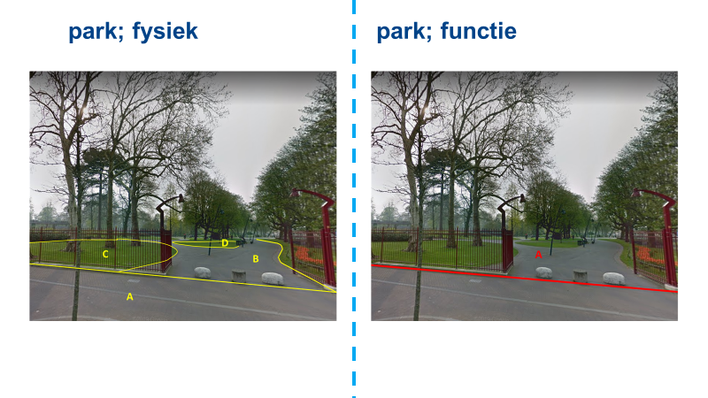
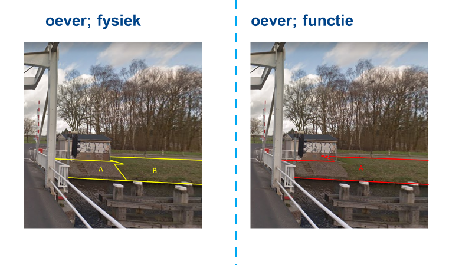

## Bijlagen

### Bijlage 1 Lijst met afkortingen

|TERM	|OMSCHRIJVING|
|-------|------------|
|Aquo	|Standaard binnen de watersector|
|BAG	|Basisregistratie Adressen en Gebouwen|
|BGT	|Basisregistratie Grootschalige Topografie|
|BOR	|Beheer Openbare Ruimte|
|BRK	|Basisregistratie Kadaster|
|BRT	|Basisregistratie Topografie|
|IMBOR	|Informatiemodel Beheer Openbare Ruimte (CROW)|
|IMGeo	|Informatiemodel Geografie|
|IMWV	|Informatiemodel Wegen en Verkeer (CROW)|
|NWB	|Nationaal Wegenbestand (RWS)|
|SOR	|Samenhangende Objectenregistratie|
|WOZ	|Basisregistratie Waardering Onroerende Zaken|
|3D	    |Het begrip driedimensionaal of 3D duidt in |
|       |dit geval aan dat de geometrie van een |
|       |ruimtelijk object met drie meetkundige |
|       |dimensies wordt beschreven en vastgelegd|

 
### Bijlage 2 Voorbeelden onderscheid fysieke objecten en functionele objecten
In de SOR worden functionele en fysieke objecten altijd als aparte objecttypen getypeerd, als de begrenzing ervan kan verschillen. Hieronder zijn een aantal voorbeelden opgenomen die het onderscheid tussen functionele en fysieke objecten laten zien.

### Bijlage 3 Aanbevelingen van interbestuurlijke werkgroepen

Rapport werkgroep Wegen, versie 1.0, 3 september 2019 (https://www.geobasisregistraties.nl/basisregistraties/documenten/rapport/2019/11/07/verkenning-samenhangende-objectenregistratie-eindrapport-werkgroep-wegen)

| Aanbevelingen                                                                                                                                                                                                                                                                                                                                                                                                                                                                                                                                                              	| Uitwerking in synthese rapport                                                                                                                                                                                                                                                                                                                                                                                                                                                                                                                                                                                                             	|
|----------------------------------------------------------------------------------------------------------------------------------------------------------------------------------------------------------------------------------------------------------------------------------------------------------------------------------------------------------------------------------------------------------------------------------------------------------------------------------------------------------------------------------------------------------------------------	|--------------------------------------------------------------------------------------------------------------------------------------------------------------------------------------------------------------------------------------------------------------------------------------------------------------------------------------------------------------------------------------------------------------------------------------------------------------------------------------------------------------------------------------------------------------------------------------------------------------------------------------------	|
| Volledigheid                                                                                                                                                                                                                                                                                                                                                                                                                                                                                                                                                               	|                                                                                                                                                                                                                                                                                                                                                                                                                                                                                                                                                                                                                                            	|
| Alle genoemde objecten en kenmerken zijn vanuit het perspectief van wegen verplicht onderdeel van de samenhangende objectenregistratie. Voor het wegenverkeersnet geldt dat het een aaneengesloten samenstel van objecten moet zijn, dit geldt zowel voor de topografie als voor het wegennetwerk.                                                                                                                                                                                                                                                                         	| In de SOR is de opname van zowel verplichte als vrijwillige inhoud mogelijk. De vanuit het perspectief van wegen voorgestelde objecten en kenmerken zullen vooralsnog in het verplichte gedeelte van het model worden opgenomen. Ook het vereiste dat sprake moet zijn van een aaneengesloten samenstel van objecten wordt als uitgangspunt meegenomen.                                                                                                                                                                                                                                                                                    	|
| Actualiteit                                                                                                                                                                                                                                                                                                                                                                                                                                                                                                                                                                	|                                                                                                                                                                                                                                                                                                                                                                                                                                                                                                                                                                                                                                            	|
| Wegen moeten uiterlijk op datum ‘start aanleg’ of ‘start reconstructie’ met status plan worden vastgelegd in de samenhangende objectenregistratie, dit geldt zowel voor de topografie als voor het wegennetwerk.  Bij ingebruikname / openstelling van een weg, wordt de plan status gewijzigd in een status bestaand voor het wegennetwerk, zodat het voor routering bruikbaar is. En voor wegtopografie wordt de plan status gewijzigd in een status gerealiseerd, niet ingemeten. Binnen 6 maanden wordt de topografie ingewonnen en verandert de status naar bestaand. 	| De voorgestelde werkwijze met statussen komt in belangrijke mate overeen met de werkwijze zoals deze voor de SOR wordt beoogd. Daarbij zal er in elk geval door middel van statussen gaan worden geborgd dat de actualiteit van informatie over wegen wordt vergroot. De vraag in hoeverre dit ook verplicht noodzakelijk is voor de wegtopografie zal in het vervolg nog nader moeten worden bekeken.                                                                                                                                                                                                                                     	|
| Nauwkeurigheid                                                                                                                                                                                                                                                                                                                                                                                                                                                                                                                                                             	|                                                                                                                                                                                                                                                                                                                                                                                                                                                                                                                                                                                                                                            	|
| De eisen aan nauwkeurigheid van topografie worden overgenomen van de BGT. De nauwkeurigheidseis die gesteld wordt aan verbindingen en knooppunten is dat zij moeten liggen binnen de wegtopografie.                                                                                                                                                                                                                                                                                                                                                                        	| De kwaliteitscriteria zullen op een later moment nog worden bepaald. De hier gevraagde kwaliteit (BGT kwaliteit) zou echter niet tot knelpunten moeten leiden. De gestelde eis dat verbindingen en knooppunten moeten liggen binnen de wegtopografie, zal in het ontwerp van de SOR worden opgenomen.                                                                                                                                                                                                                                                                                                                                      	|
| Algemeen                                                                                                                                                                                                                                                                                                                                                                                                                                                                                                                                                                   	|                                                                                                                                                                                                                                                                                                                                                                                                                                                                                                                                                                                                                                            	|
| -    In de samenhangende objectenregistratie worden alle wegen vastgelegd. Wegen op particuliere en bedrijventerreinen worden opgenomen voor zover dit nodig is voor de uitvoering van wettelijke taken bijvoorbeeld voor de inzet van hulpdiensten en de dienstverlening door netbeheerders.                                                                                                                                                                                                                                                                              	| De vanuit het perspectief van wegen voorgestelde populatie van objecten zal vooralsnog in de SOR worden gevolgd. Ook de voorgestelde ondergrens van (onverharde) weginfrastructuur in natuurgebieden zal worden meegenomen in de verdere uitwerking van de SOR. Bij de voor aggregatie noodzakelijke uniformiteit en homogeniteit lijkt vooral sprake te zijn van een kwaliteitsvraagstuk waar ook al in de huidige situatie aan gewerkt kan worden. Daar waar inwinregels onvoldoende scherp zijn afgebakend, zouden deze verder moeten worden verhelderd. Deze kunnen dan in het ontwerp van de SOR worden verankerd.                    	|
| -    Stel een ondergrens vast voor het opnemen van natuur- en bospaden in de samenhangende objectenregistratie conform de huidige aanpak van de BRT.                                                                                                                                                                                                                                                                                                                                                                                                                       	|                                                                                                                                                                                                                                                                                                                                                                                                                                                                                                                                                                                                                                            	|
| -    Leg de wegen zo vast dat zij eenvoudig naar een hoger beschouwingsniveau zijn te aggregeren. Dit stelt veel eisen aan uniformiteit en homogeniteit om alle bronhouders de wegen op dezelfde wijze te laten vastleggen.                                                                                                                                                                                                                                                                                                                                                	|                                                                                                                                                                                                                                                                                                                                                                                                                                                                                                                                                                                                                                            	|
| Wegenlegger                                                                                                                                                                                                                                                                                                                                                                                                                                                                                                                                                                	|                                                                                                                                                                                                                                                                                                                                                                                                                                                                                                                                                                                                                                            	|
| Elke gemeente in Nederland moet op grond van de Wegenwet over een wegenlegger beschikken. Een wegenlegger toont de openbare wegen en paden buiten de bebouwde kom en hoe de verantwoordelijkheid en onderhoudsplicht voor deze wegen is georganiseerd.  Als de samenhangende objectenregistratie een landsdekkende vastlegging van wegen bevat is dit een wettelijke basis om een wegenlegger als product daarvan te kunnen afgeleiden.                                                                                                                                    	| Dit is geen ontwerpvraagstuk voor de SOR. De vanuit het domein wegen voorgestelde wenselijke afstemming van de wegenlegger op de SOR is een aandachtspunt dat bij het ministerie van I&W zal moeten worden belegd.                                                                                                                                                                                                                                                                                                                                                                                                                         	|
|                                                                                                                                                                                                                                                                                                                                                                                                                                                                                                                                                                            	|                                                                                                                                                                                                                                                                                                                                                                                                                                                                                                                                                                                                                                            	|
| wegennetwerk                                                                                                                                                                                                                                                                                                                                                                                                                                                                                                                                                               	|                                                                                                                                                                                                                                                                                                                                                                                                                                                                                                                                                                                                                                            	|
| Er is een aantoonbare behoefte vanuit een breed aantal beleidsthema’s en de daarbij behorende processen aan een routeerbaar wegennetwerk.                                                                                                                                                                                                                                                                                                                                                                                                                                  	| In de SOR is de opname van een routeerbaar wegennetwerk voorzien.                                                                                                                                                                                                                                                                                                                                                                                                                                                                                                                                                                          	|
|                                                                                                                                                                                                                                                                                                                                                                                                                                                                                                                                                                            	|                                                                                                                                                                                                                                                                                                                                                                                                                                                                                                                                                                                                                                            	|
| Neem verbindingen en knooppunten om de wegen functioneel te duiden en om dit te gebruiken als een routeerbaar netwerk voor verschillende verkeerscategorieën.                                                                                                                                                                                                                                                                                                                                                                                                              	| In de SOR is de opname van verbindingen en knooppunten voorzien. Een functionele duiding kan met deze verbindingen en knooppunten plaatsvinden.                                                                                                                                                                                                                                                                                                                                                                                                                                                                                            	|
|                                                                                                                                                                                                                                                                                                                                                                                                                                                                                                                                                                            	|                                                                                                                                                                                                                                                                                                                                                                                                                                                                                                                                                                                                                                            	|
| Het model voorziet erin dat bij verbindingen vastgelegd kan worden voor welke (combinatie van) weggebruikers deze verbinding is bedoeld.                                                                                                                                                                                                                                                                                                                                                                                                                                   	| In de SOR is de opname van verbindingen voorzien. De exacte invulling daarvan zal bij het verder uitwerken van het inhoudelijk denkraam worden bepaald. Dit vanuit het domein wegen aangedragen aandachtspunt zal daarbij worden meegenomen.                                                                                                                                                                                                                                                                                                                                                                                               	|
|                                                                                                                                                                                                                                                                                                                                                                                                                                                                                                                                                                            	|                                                                                                                                                                                                                                                                                                                                                                                                                                                                                                                                                                                                                                            	|
| De borging van bepaalde kenmerken van verbindingen ligt in genomen verkeersbesluiten door de overheid. Deze gelegitimeerde werkelijkheid is voor veel afnemers van belang. Dit is belangrijker dan het registreren van de locatie van het bijbehorend verkeersbord.                                                                                                                                                                                                                                                                                                        	| Dit is geen ontwerpvraagstuk voor de inhoud van de SOR. De vanuit het domein wegen voorgestelde wenselijke afstemming van verkeersbesluiten op de SOR is een aandachtspunt dat bij het ministerie van I&W zal moeten worden belegd. Wel sluit de vanuit het domein wegen voorgestelde benadering goed aan op de wijze waarop voor andere objecttypen in het inhoudelijk denkraam met brondocumenten wordt omgegaan. In de verdere uitwerking zal nader onderzoek worden gedaan naar de wenselijkheid om de bebouwde kom aan de SOR toe te voegen.                                                                                          	|
| -    Er moet een verwijzing worden vastgelegd naar dat verkeersbesluit plus de bijbehorende ingangsdatum.                                                                                                                                                                                                                                                                                                                                                                                                                                                                  	|                                                                                                                                                                                                                                                                                                                                                                                                                                                                                                                                                                                                                                            	|
| -    Nader onderzoek is nodig om te bepalen of deze verkeersbesluiten eenduidig genoeg de locatie vastleggen en welke maatregelen genomen moeten worden om dit te optimaliseren.                                                                                                                                                                                                                                                                                                                                                                                           	|                                                                                                                                                                                                                                                                                                                                                                                                                                                                                                                                                                                                                                            	|
| -    Sommige verkeersbesluiten worden genomen op het niveau van een bebouwde kom en gelden dan voor de inliggende wegen tenzij een ander verkeersbesluit anders bepaalt. De ligging van de komgrenzen is op dit moment niet eenduidig en het meervoudig vastleggen van een dergelijk kom-gerelateerd verkeersbesluit bij de inliggende wegen lijkt voor de hand te liggen, ook om daarmee verkeersbesluiten op één plek vast te leggen in het model om de toegankelijkheid van het gebruik te bevorderen.                                                                  	|                                                                                                                                                                                                                                                                                                                                                                                                                                                                                                                                                                                                                                            	|
|                                                                                                                                                                                                                                                                                                                                                                                                                                                                                                                                                                            	|                                                                                                                                                                                                                                                                                                                                                                                                                                                                                                                                                                                                                                            	|
| Ontwikkelaars van navigatiesystemen geven aan dat veel data zelf wordt ingewonnen en dat men daarbij niet de overheid per se nodig heeft, maar de overheid maakt het de maatschappij wel veel makkelijker als de data wordt opengesteld die toch al beschikbaar is in de overheidsprocessen. Waar men de overheid wel nadrukkelijk nodig heeft is als de overheid verkeersbesluiten neemt. Men wil graag voor of op de ingangsdatum van de maatregel weten dat deze maatregel er is en voor welke verbinding deze maatregel geldt.                                         	| Dit is geen ontwerpvraagstuk voor de inhoud van de SOR. De vanuit het domein wegen voorgestelde wenselijke afstemming is een aandachtspunt dat bij het ministerie van I&W zal moeten worden belegd.                                                                                                                                                                                                                                                                                                                                                                                                                                        	|
|                                                                                                                                                                                                                                                                                                                                                                                                                                                                                                                                                                            	|                                                                                                                                                                                                                                                                                                                                                                                                                                                                                                                                                                                                                                            	|
| Naamgeving en vindbaarheid                                                                                                                                                                                                                                                                                                                                                                                                                                                                                                                                                 	|                                                                                                                                                                                                                                                                                                                                                                                                                                                                                                                                                                                                                                            	|
| De naamgeving van wegen is een kenmerk wat qua ordening het beste bij het wegennetwerk past en niet bij wegdelen.                                                                                                                                                                                                                                                                                                                                                                                                                                                          	| In de SOR zal de mogelijkheid geboden gaan worden om de geometrie van openbare ruimten op te nemen. Aan de ene kant door het vrijwillig kunnen vastleggen van een bij een besluit behorende geometrie. Aan de andere kant door het koppelen van de benaming aan netwerksegmenten. Deze oplossing zal ook voor wegen worden gevolgd.                                                                                                                                                                                                                                                                                                        	|
|                                                                                                                                                                                                                                                                                                                                                                                                                                                                                                                                                                            	|                                                                                                                                                                                                                                                                                                                                                                                                                                                                                                                                                                                                                                            	|
| 2,5- en 3D topografie van wegen                                                                                                                                                                                                                                                                                                                                                                                                                                                                                                                                            	|                                                                                                                                                                                                                                                                                                                                                                                                                                                                                                                                                                                                                                            	|
| -    Vanuit het gebruik wordt nu nog geen meervoudig belang aangedragen voor het vastleggen van een 3D-model met volumes.                                                                                                                                                                                                                                                                                                                                                                                                                                                  	| Binnen de SOR zal de mogelijkheid ontstaan om 3D geometrie van objecten op te nemen. De mate waarin dit mogelijk wordt kan verschillen voor de diverse objecttypen. In de aanloop daarheen zal het naar verwachting nog gedurende lange tijd mogelijk blijven om (ook) 2D of 2,5D geometrie op te nemen. Deze zullen dus naast elkaar gaan bestaan. In de verdere uitwerking zal nog worden bepaald op welke wijze dit kan worden vormgegeven. In de verdere uitwerking zal nader onderzoek worden gedaan naar de wenselijkheid om maximale doorrijhoogten aan de SOR toe te voegen dan wel deze in een sectorale registratie op te nemen. 	|
| -    Er is wel meervoudig behoefte aan de hoogte (ten opzichte van NAP) van een weg (ook wel de 2,5D-dimensie genoemd).                                                                                                                                                                                                                                                                                                                                                                                                                                                    	|                                                                                                                                                                                                                                                                                                                                                                                                                                                                                                                                                                                                                                            	|
| -    Advies : hanteer dit als een vrijwillig kenmerk wat middels een groeimodel wordt bijgehouden tot het verplicht wordt gesteld.                                                                                                                                                                                                                                                                                                                                                                                                                                         	|                                                                                                                                                                                                                                                                                                                                                                                                                                                                                                                                                                                                                                            	|
| -    Ook is er een brede behoefte aan de maximale doorrijhoogte van een verbinding, als deze afwijkt.                                                                                                                                                                                                                                                                                                                                                                                                                                                                      	|                                                                                                                                                                                                                                                                                                                                                                                                                                                                                                                                                                                                                                            	|
|                                                                                                                                                                                                                                                                                                                                                                                                                                                                                                                                                                            	|                                                                                                                                                                                                                                                                                                                                                                                                                                                                                                                                                                                                                                            	|
| Relaties binnen/buiten samenhangende objectenregistratie                                                                                                                                                                                                                                                                                                                                                                                                                                                                                                                   	|                                                                                                                                                                                                                                                                                                                                                                                                                                                                                                                                                                                                                                            	|
| Relatie met kunstwerken. Het kan nog een overweging zijn om specifiek beweegbare bruggen in de samenhangende objectenregistratie op te nemen om bij een routeerbaar netwerk rekening mee te houden.                                                                                                                                                                                                                                                                                                                                                                        	| In de SOR is de opname van kunstwerken voorzien. De exacte invulling daarvan zal bij het verder uitwerken van het inhoudelijk denkraam worden bepaald. Dit vanuit het domein wegen aangedragen aandachtspunt zal daarbij worden meegenomen.                                                                                                                                                                                                                                                                                                                                                                                                	|
|                                                                                                                                                                                                                                                                                                                                                                                                                                                                                                                                                                            	|                                                                                                                                                                                                                                                                                                                                                                                                                                                                                                                                                                                                                                            	|
| Het is aan te bevelen om veerponten op te nemen als kenmerk bij een verbinding. (met daarbij de vastlegging van het type toegestaan vervoer en eventueel de vaarperiodes)                                                                                                                                                                                                                                                                                                                                                                                                  	| In de SOR is de opname van verbindingen voorzien. De exacte invulling daarvan zal bij het verder uitwerken van het inhoudelijk denkraam worden bepaald. Dit vanuit het domein wegen aangedragen aandachtspunt zal daarbij worden meegenomen.                                                                                                                                                                                                                                                                                                                                                                                               	|
|                                                                                                                                                                                                                                                                                                                                                                                                                                                                                                                                                                            	|                                                                                                                                                                                                                                                                                                                                                                                                                                                                                                                                                                                                                                            	|
| Relatie met gebouwen is van groot belang                                                                                                                                                                                                                                                                                                                                                                                                                                                                                                                                   	| In de verdere uitwerking van het inhoudelijke denkraam zal aan deze vanuit het domein wegen benoemde relatie aandacht worden besteed.                                                                                                                                                                                                                                                                                                                                                                                                                                                                                                      	|
| -    Ligging – noodzakelijk voor integrale benadering                                                                                                                                                                                                                                                                                                                                                                                                                                                                                                                      	|                                                                                                                                                                                                                                                                                                                                                                                                                                                                                                                                                                                                                                            	|
| -    Adressering  - noodzakelijk voor routering                                                                                                                                                                                                                                                                                                                                                                                                                                                                                                                            	|                                                                                                                                                                                                                                                                                                                                                                                                                                                                                                                                                                                                                                            	|
| Leg niet-verplichte objecten en kenmerken altijd buiten de samenhangende objectenregistratie vast maar zorg voor een heldere verbinding met de samenhangende objectenregistratie.                                                                                                                                                                                                                                                                                                                                                                                          	| Uitgangspunt van de SOR is dat opname van zowel verplichte als vrijwillige inhoud mogelijk is. Deze aanbeveling vanuit het domein wegen wordt dan ook niet overgenomen. Wel zal voldoende moeten worden geborgd dat het voor gebruikers altijd helder is dat er sprake is van een verplichte of vrijwillige inhoud en dus van de te verwachten volledigheid.                                                                                                                                                                                                                                                                               	|
|                                                                                                                                                                                                                                                                                                                                                                                                                                                                                                                                                                            	|                                                                                                                                                                                                                                                                                                                                                                                                                                                                                                                                                                                                                                            	|
| BRT                                                                                                                                                                                                                                                                                                                                                                                                                                                                                                                                                                        	|                                                                                                                                                                                                                                                                                                                                                                                                                                                                                                                                                                                                                                            	|
| -    Zie de BRT niet als een aparte basisregistratie die wordt afgeleid uit de samenhangende objectenregistratie, maar als een geaggregeerd en gegeneraliseerd product wat volledig geautomatiseerd wordt afgeleid uit objecten uit de samenhangende objectenregistratie. Dit geldt voor het aspect wegen maar ook breder. Zorg er voor dat gegevens die nu landelijk in de BRT worden bijgehouden, in de samenhangende objectenregistratie hun plek krijgen.                                                                                                              	| De voorgestelde relatie met de BRT komt in belangrijke mate overeen met de werkwijze zoals deze voor de SOR wordt beoogd. Bij de voor aggregatie noodzakelijke uniformiteit en homogeniteit lijkt vooral sprake te zijn van een kwaliteitsvraagstuk waar ook al in de huidige situatie aan gewerkt kan worden. Daar waar inwinregels onvoldoende scherp zijn afgebakend, zouden deze verder moeten worden verhelderd. Deze kunnen dan in het ontwerp van de SOR worden verankerd.                                                                                                                                                          	|
| -    Het is voor bijvoorbeeld het afleiden van een topografische kaart als de BRT uit de BGT van groot belang dat alle bronhouders de afbakeningsregels op dezelfde manier interpreteren. Anders gaat dat ten koste van de continuïteit van het wegennetwerk op de gebiedsgrenzen tussen bronhouders.                                                                                                                                                                                                                                                                      	|                                                                                                                                                                                                                                                                                                                                                                                                                                                                                                                                                                                                                                            	|
| Digital twin                                                                                                                                                                                                                                                                                                                                                                                                                                                                                                                                                               	|                                                                                                                                                                                                                                                                                                                                                                                                                                                                                                                                                                                                                                            	|
| Onderzoek de mogelijkheid van de samenhangende objectenregistratie  als een Digitale TWIN. (A digital twin is a digital copy of any given product updated in real-time.)                                                                                                                                                                                                                                                                                                                                                                                                   	| Binnen de SOR zal de mogelijkheid ontstaan om 3D geometrie van objecten op te nemen. Hiermee zou op termijn een digitale twin kunnen ontstaan. Dit is op dit moment echter geen specifiek aandachtspunt bij de verdere uitwerking.                                                                                                                                                                                                                                                                                                                                                                                                         	|

Rapport werkgroep Water, versie 1.0, 23 oktober 2019 (https://www.geobasisregistraties.nl/basisregistraties/documenten/rapport/2019/11/07/verkenning-samenhangende-objectenregistratie-eindrapport-werkgroep-water)

| Aanbevelingen                                                                                                                                                                                                                                                                                                                                                                                                                                                                                                                                                                                                                                                                                                                                                                                                                                                    	| Uitwerking in synthese rapport                                                                                                                                                                                                                                                                                                                                                                                                                                                                                                                                                                                                                                                                                                              	|
|------------------------------------------------------------------------------------------------------------------------------------------------------------------------------------------------------------------------------------------------------------------------------------------------------------------------------------------------------------------------------------------------------------------------------------------------------------------------------------------------------------------------------------------------------------------------------------------------------------------------------------------------------------------------------------------------------------------------------------------------------------------------------------------------------------------------------------------------------------------	|---------------------------------------------------------------------------------------------------------------------------------------------------------------------------------------------------------------------------------------------------------------------------------------------------------------------------------------------------------------------------------------------------------------------------------------------------------------------------------------------------------------------------------------------------------------------------------------------------------------------------------------------------------------------------------------------------------------------------------------------	|
| Algemeen                                                                                                                                                                                                                                                                                                                                                                                                                                                                                                                                                                                                                                                                                                                                                                                                                                                         	|                                                                                                                                                                                                                                                                                                                                                                                                                                                                                                                                                                                                                                                                                                                                             	|
| Beheer: kwaliteit/ betrouwbaarheid en actualiteit.                                                                                                                                                                                                                                                                                                                                                                                                                                                                                                                                                                                                                                                                                                                                                                                                               	|                                                                                                                                                                                                                                                                                                                                                                                                                                                                                                                                                                                                                                                                                                                                             	|
| -    In het huidige stelsel van (basis)registraties verschillen de eisen wat betreft actualiteit en kwaliteit van vergelijkbare objecten en kenmerken. Hierdoor levert combinatie van gegevens uit verschillende registraties problemen op.                                                                                                                                                                                                                                                                                                                                                                                                                                                                                                                                                                                                                      	| De kwaliteitscriteria zullen op een later moment nog worden bepaald. Hierbij kunnen de behoeften vanuit het domein water ten aanzien van de kwaliteitseisen aan basisregistraties worden meegenomen. Deze behoefte zal door de gebruikers vanuit het domein water dan wel zo concreet mogelijk moeten worden geformuleerd. Toezicht door een regieorganisatie is geen ontwerpvraagstuk voor de SOR. Afspraken over de inrichting van kwaliteitsborging en toezicht zullen worden gemaakt bij de verdere besluitvorming over de SOR.                                                                                                                                                                                                         	|
| -    Stel eisen aan het beheer, kwaliteit en actualiteit van gegevens van de aangewezen bronhouders. Een regieorganisatie dient hierop toe te zien en dit te signaleren.                                                                                                                                                                                                                                                                                                                                                                                                                                                                                                                                                                                                                                                                                         	|                                                                                                                                                                                                                                                                                                                                                                                                                                                                                                                                                                                                                                                                                                                                             	|
| Gebruik bestaande standaarden en informatiemodellen/ systemen.                                                                                                                                                                                                                                                                                                                                                                                                                                                                                                                                                                                                                                                                                                                                                                                                   	|                                                                                                                                                                                                                                                                                                                                                                                                                                                                                                                                                                                                                                                                                                                                             	|
| -    In de huidige situatie is water beschreven in verschillende informatiemodellen. Deze modellen verschillen qua detaillering en doelgroep. Welke onderdelen geschikt zijn voor opname in de uniforme samenhangende objectenregistratie dient met de usecase nader uitgewerkt te worden. Wel dienen deze registraties in samenhang vanuit een metamodel (figuur 10) onderling in verbinding te worden gebracht.                                                                                                                                                                                                                                                                                                                                                                                                                                                	| Aansluiting op bestaande informatiemodellen wordt meegenomen in het ontwerp van de SOR. In de verdere uitwerking zal een aantal vraagstukken die de onderlinge samenhang bemoeilijken nog nader worden bekeken. Hierbij zal dan ook duidelijk moeten worden wat dit betekent voor de exacte inhoud van de SOR in relatie tot water. De aanbeveling om een koepelorganisatie een regiefunctie te laten vervullen is geen ontwerpvraagstuk voor de SOR. Hierin zal het domein water voor wat betreft de waterstandaarden zelf stappen moeten zetten.                                                                                                                                                                                          	|
| -    Laat een koepelorganisatie hierin de regiefunctie vervullen.                                                                                                                                                                                                                                                                                                                                                                                                                                                                                                                                                                                                                                                                                                                                                                                                	|                                                                                                                                                                                                                                                                                                                                                                                                                                                                                                                                                                                                                                                                                                                                             	|
| Inhoudelijk                                                                                                                                                                                                                                                                                                                                                                                                                                                                                                                                                                                                                                                                                                                                                                                                                                                      	|                                                                                                                                                                                                                                                                                                                                                                                                                                                                                                                                                                                                                                                                                                                                             	|
| Verbeter landelijke water(transport)netwerkgeometrie.                                                                                                                                                                                                                                                                                                                                                                                                                                                                                                                                                                                                                                                                                                                                                                                                            	|                                                                                                                                                                                                                                                                                                                                                                                                                                                                                                                                                                                                                                                                                                                                             	|
| -    Welke water- en vervoersnetwerken zijn nodig en tot op welk detailniveau?                                                                                                                                                                                                                                                                                                                                                                                                                                                                                                                                                                                                                                                                                                                                                                                   	| In de SOR is ook de opname van netwerken van wegen, spoor en water voorzien. De exacte invulling daarvan zal bij het verder uitwerken van het inhoudelijk denkraam worden bepaald. De vanuit het domein water aangedragen vragen en aandachtspunten zullen daarbij worden meegenomen. Hierbij zal er ook aandacht moeten worden besteed aan de verschillende typen netwerken (zoals hydrologische netwerken en vervoersnetwerken).                                                                                                                                                                                                                                                                                                          	|
| -    Beheer en bijhouding van hartlijnen water (Hydrologisch Netwerk) NHI. Het gaat hierbij ook om de stroomrichting en de relaties tussen de hartlijnen.                                                                                                                                                                                                                                                                                                                                                                                                                                                                                                                                                                                                                                                                                                        	|                                                                                                                                                                                                                                                                                                                                                                                                                                                                                                                                                                                                                                                                                                                                             	|
| -    De actualiteit en het detailniveau zullen vermoedelijk doorslaggevend zijn voor de instandhouding. Ergens zal er een afweging gemaakt moeten worden tussen de inspanning voor topografie en netwerk (topografische data vraagt meer inspanning).                                                                                                                                                                                                                                                                                                                                                                                                                                                                                                                                                                                                            	|                                                                                                                                                                                                                                                                                                                                                                                                                                                                                                                                                                                                                                                                                                                                             	|
| -    Standaardisering van gebruik van verschillende definities. Er is een onderscheid naar hartlijnenkeringen en aslijnenkeringen.                                                                                                                                                                                                                                                                                                                                                                                                                                                                                                                                                                                                                                                                                                                               	|                                                                                                                                                                                                                                                                                                                                                                                                                                                                                                                                                                                                                                                                                                                                             	|
| -    Werk vanuit standaarden en conform architectuurdefinities. Laat bestaande standaarden leidend zijn en zie hierop toe.                                                                                                                                                                                                                                                                                                                                                                                                                                                                                                                                                                                                                                                                                                                                       	|                                                                                                                                                                                                                                                                                                                                                                                                                                                                                                                                                                                                                                                                                                                                             	|
| Netwerk                                                                                                                                                                                                                                                                                                                                                                                                                                                                                                                                                                                                                                                                                                                                                                                                                                                          	|                                                                                                                                                                                                                                                                                                                                                                                                                                                                                                                                                                                                                                                                                                                                             	|
| -    Als voorbeeld (figuur 11) vaarnetwerk: hier gaat het om de routering en de relatie tussen hartlijnen.                                                                                                                                                                                                                                                                                                                                                                                                                                                                                                                                                                                                                                                                                                                                                       	| In de SOR is ook de opname van netwerken van wegen, spoor en water voorzien. De exacte invulling daarvan zal bij het verder uitwerken van het inhoudelijk denkraam worden bepaald. Daarbij kunnen ook deze aandachtspunten worden meegenomen.                                                                                                                                                                                                                                                                                                                                                                                                                                                                                               	|
| -    Netwerk registratie is tevens van toepassing op hydrologische en ecologische vraagstukken.                                                                                                                                                                                                                                                                                                                                                                                                                                                                                                                                                                                                                                                                                                                                                                  	|                                                                                                                                                                                                                                                                                                                                                                                                                                                                                                                                                                                                                                                                                                                                             	|
| -    Registratie dient netwerkanalyses mogelijk te maken.                                                                                                                                                                                                                                                                                                                                                                                                                                                                                                                                                                                                                                                                                                                                                                                                        	|                                                                                                                                                                                                                                                                                                                                                                                                                                                                                                                                                                                                                                                                                                                                             	|
| Betere scheiding tussen functie en fysiek voorkomen van water.                                                                                                                                                                                                                                                                                                                                                                                                                                                                                                                                                                                                                                                                                                                                                                                                   	|                                                                                                                                                                                                                                                                                                                                                                                                                                                                                                                                                                                                                                                                                                                                             	|
| -    In het huidige stelsel van basisregistraties lopen functie en fysiek voorkomen door elkaar. Dit uit zich onder andere bij water en levert wrijving op voor beheer en onderhoud en netwerktoepassingen van water.                                                                                                                                                                                                                                                                                                                                                                                                                                                                                                                                                                                                                                            	| Het scheiden van fysieke objecten en functionele objecten is een uitgangspunt binnen de SOR. Dit gaat ook gelden voor de objecten die betrekking hebben op water. Een speciaal aandachtspunt rondom water is het feit dat door stijging en daling van het waterpeil geen harde fysieke begrenzing bestaat. Daarover zullen scherpe (uniforme) afspraken moeten worden gemaakt.                                                                                                                                                                                                                                                                                                                                                              	|
| -    Breng een duidelijke scheiding aan in de gegevensregistratie voor de objecten conform advies.                                                                                                                                                                                                                                                                                                                                                                                                                                                                                                                                                                                                                                                                                                                                                               	|                                                                                                                                                                                                                                                                                                                                                                                                                                                                                                                                                                                                                                                                                                                                             	|
| Hoogte- en niveauverschillen afstemmen.                                                                                                                                                                                                                                                                                                                                                                                                                                                                                                                                                                                                                                                                                                                                                                                                                          	|                                                                                                                                                                                                                                                                                                                                                                                                                                                                                                                                                                                                                                                                                                                                             	|
| -    Hoe kunnen in de samenhangende objectenregistratie 2D en 3D naast elkaar bestaan, zonder dat hiervoor extra inspanningen in het kader van bijhouding nodig zijn?                                                                                                                                                                                                                                                                                                                                                                                                                                                                                                                                                                                                                                                                                            	| Binnen de SOR zal de mogelijkheid ontstaan om 3D geometrie van objecten op te nemen. De mate waarin dit mogelijk wordt kan verschillen voor de diverse objecttypen. In de aanloop daarheen zal het naar verwachting nog gedurende lange tijd mogelijk blijven om (ook) 2D geometrie op te nemen. Deze zullen dus naast elkaar gaan bestaan. In de verdere uitwerking zal nog worden bepaald op welke wijze dit kan worden vormgegeven. Afspraken over de toedeling van verantwoordelijkheden zullen worden gemaakt bij de verdere besluitvorming over de SOR.                                                                                                                                                                               	|
| -    Daar waar nodig en een toegevoegde waarde heeft, prevaleert 3D registratie. Dit is vooral aan de orde bij bovengrondse objecten.                                                                                                                                                                                                                                                                                                                                                                                                                                                                                                                                                                                                                                                                                                                            	|                                                                                                                                                                                                                                                                                                                                                                                                                                                                                                                                                                                                                                                                                                                                             	|
| -    Landelijk bijhouden van een basis hoogtemodel. Wie draagt hiervoor de eindverantwoordelijkheid?                                                                                                                                                                                                                                                                                                                                                                                                                                                                                                                                                                                                                                                                                                                                                             	|                                                                                                                                                                                                                                                                                                                                                                                                                                                                                                                                                                                                                                                                                                                                             	|
| -    Gaan leveranciers van software nog investeren in functionaliteiten op 2D met niveauverschillen?                                                                                                                                                                                                                                                                                                                                                                                                                                                                                                                                                                                                                                                                                                                                                             	|                                                                                                                                                                                                                                                                                                                                                                                                                                                                                                                                                                                                                                                                                                                                             	|
| Organisatorisch                                                                                                                                                                                                                                                                                                                                                                                                                                                                                                                                                                                                                                                                                                                                                                                                                                                  	|                                                                                                                                                                                                                                                                                                                                                                                                                                                                                                                                                                                                                                                                                                                                             	|
| Verbeter de vindbaarheid van het openbare ruimte type water.                                                                                                                                                                                                                                                                                                                                                                                                                                                                                                                                                                                                                                                                                                                                                                                                     	|                                                                                                                                                                                                                                                                                                                                                                                                                                                                                                                                                                                                                                                                                                                                             	|
| -   Afstemminging DAMO, IMWA en BOR. In het huidige stelsel van basisregistraties ontbreekt geometrie van openbare ruimten van type water. In de huidige praktijk wordt in de regel gebruik gemaakt van een omschrijving i.p.v. een locatie op de kaart. Met de opkomst en het wijdverspreide gebruik van GIS-viewers is het belang toegenomen om de omschrijving te koppelen aan een eenduidige locatie op de kaart. In een raadsbesluit, dat de openbare ruimte vaststelt, wordt soms de openbare ruimtenaam van een kunstwerk, (gemaal, stuw) benoemd via BAG-openbare ruimte en op een bijbehorende situatietekening afgebakend. De naam is afkomstig van de waterbeheerder. Het detailniveau van de afbakening op de situatietekening is nu nog per gemeente verschillend. De ontwikkelingen rondom IMBOR, IMGeo bieden geen oplossingen voor dit probleem. 	| Het voorzien van elk object van een unieke identificatie is een uitgangspunt van de SOR. Ook zal de mogelijkheid geboden gaan worden om de geometrie van openbare ruimten in de SOR op te nemen. Aan de ene kant door het vrijwillig kunnen vastleggen van een bij een besluit behorende geometrie. Aan de andere kant door het koppelen van de benaming aan netwerksegmenten. Deze oplossing zal ook voor water worden gevolgd. De detailuitwerking daarvan dient nog plaats te vinden. Een aandachtspunt daarbij is ook het maken van afspraken over de naamgeving van objecten die zich uitstrekken over meerdere bronhouders. Er bestaat een nadrukkelijke relatie met de naamgeving van andere objecten (zoals gebouwen en complexen). 	|
| -    Elk object dient voorzien te worden van een heldere identificatie nummer en naam. (onder aansturing van een afgestemde naamgevingsconventie)                                                                                                                                                                                                                                                                                                                                                                                                                                                                                                                                                                                                                                                                                                                	|                                                                                                                                                                                                                                                                                                                                                                                                                                                                                                                                                                                                                                                                                                                                             	|
| -    Indien een object meerdere partijen zeggenschap hebben over een object, dan dient de naamgeving van het object gelijk te zijn.                                                                                                                                                                                                                                                                                                                                                                                                                                                                                                                                                                                                                                                                                                                              	|                                                                                                                                                                                                                                                                                                                                                                                                                                                                                                                                                                                                                                                                                                                                             	|
| Centraal vastleggen in de basisregistratie, lokaal bijhouden door bronhouders.                                                                                                                                                                                                                                                                                                                                                                                                                                                                                                                                                                                                                                                                                                                                                                                   	|                                                                                                                                                                                                                                                                                                                                                                                                                                                                                                                                                                                                                                                                                                                                             	|
| -    Voor de samenhangende objectenregistratie komt een landelijke voorziening, waarin bronhouders haar wijziging in hun kernregistratie doorvoeren en deze bij het verkrijgen van een besluitvormende status (bv. legger/beheerregister) direct wordt doorgevoerd in de landelijke basisregistratie. Deze bijhouding vindt plaats op basis van meer landelijk geüniformeerde werkprocessen. Waterobjecten en waterstaatsobjecten dienen zo te worden vastgelegd dat samenstel voor verschillende gebruikers mogelijk is. Hierin staat het geïntegreerd beheren van objecten in plaats van registraties centraal. Gebruikers kunnen gegevens direct uit de objectenregistratie opvragen met behulp van moderne bevragingstechnieken (API’s).                                                                                                                     	| De exacte invulling van voorzieningen is nu geen ontwerpvraagstuk voor de SOR. De voorgestelde werkwijze komt verder wel in belangrijke mate overeen met de werkwijze zoals deze voor de SOR wordt beoogd. Het aan de hand van usecases uitwerken van de wijze waarop vastlegging van gegevens op een federatieve wijze kan plaatsvinden is een suggestie die bij de verdere uitwerking van de SOR zal worden meegenomen. Het verder uitwerken van de mogelijkheden om collectief bepaalde watergegevens vast te leggen en te ontsluiten is aan het domein water.                                                                                                                                                                           	|
| -    Aan de hand van de usecase uitwerken welke gegevens centraal dienen te worden vastgelegd en welke via een gefedereerde mechanismen decentraal in de kernregistratie van de bronhouders komt te liggen.                                                                                                                                                                                                                                                                                                                                                                                                                                                                                                                                                                                                                                                      	|                                                                                                                                                                                                                                                                                                                                                                                                                                                                                                                                                                                                                                                                                                                                             	|
| Governance inrichten voor vernieuwing/verbetering.                                                                                                                                                                                                                                                                                                                                                                                                                                                                                                                                                                                                                                                                                                                                                                                                               	|                                                                                                                                                                                                                                                                                                                                                                                                                                                                                                                                                                                                                                                                                                                                             	|
| -    Onderstaande figuur geeft grofweg weer met welke basisregistraties we van doen hebben en hoe die vanuit de huidige situatie in 2019 de komende jaren zouden moeten migreren naar een samenhangende objectenregistratie. Hier zijn aanpalende registraties nog niet in meegenomen. De zaken die de aspecten ‘Water’ betreffen zijn met ROOD aangemerkt. Nota bene: Deze figuur is niet limitatief bedoeld. Als andere registraties betrokken worden, zoals het NWB, dan kennen deze ook een route naar de samenhangende objectenregistratie.                                                                                                                                                                                                                                                                                                                 	| Dit is geen ontwerpvraagstuk voor de SOR. Afspraken over de governance zullen worden gemaakt bij de verdere besluitvorming over de SOR. Vanuit het domein water wordt daarbij meegegeven dat er in elk geval een duidelijke toedeling van verantwoordelijkheden voor het bijhouden van waterobjecten moet plaatsvinden.                                                                                                                                                                                                                                                                                                                                                                                                                     	|
| -    Er dient helder aangegeven te worden welke bronhouders verantwoordelijk zijn voor welke objecten. Aanvullend wordt er vanuit koepelverantwoordelijkheid gestuurd op de kwaliteit, volledigheid en accuraatheid.                                                                                                                                                                                                                                                                                                                                                                                                                                                                                                                                                                                                                                             	|                                                                                                                                                                                                                                                                                                                                                                                                                                                                                                                                                                                                                                                                                                                                             	|
| Informatiebehoefte, objecten en kenmerken in objectenregistratie.                                                                                                                                                                                                                                                                                                                                                                                                                                                                                                                                                                                                                                                                                                                                                                                                	|                                                                                                                                                                                                                                                                                                                                                                                                                                                                                                                                                                                                                                                                                                                                             	|
| -    In het huidige stelsel van (basis)registraties ontbreken objecten en kenmerken die landsbreed meervoudig gebruikt of gewenst worden. Deze objecten worden nu nog op meerdere plaatsen in aparte registraties bijgehouden, waardoor (soms tegenstrijdige) dubbelingen zijn ontstaan.                                                                                                                                                                                                                                                                                                                                                                                                                                                                                                                                                                         	| Daar waar sprake is van een behoefte aan landsbreed en binnen meerdere sectoren te gebruiken objecten en kenmerken, dan kunnen deze bij de verdere uitwerking van de SOR worden meegenomen. Deze behoefte zal door de gebruikers vanuit het domein water dan wel zo concreet mogelijk moeten worden geformuleerd.                                                                                                                                                                                                                                                                                                                                                                                                                           	|
| -    Gebruikers hebben de behoefte aan een eenduidige en vooral landsdekkende registratie. Bepaal duidelijk het mogelijke gebruik van de informatie aan de hand van usecases en bepaal welke organisatie als bronhouder verantwoordelijk is voor welke set van objecten. Ook bij dit onderdeel is vanuit standaardisatie (Aquo-standaard) een overkoepelende sturing op samenhang onontbeerlijk.                                                                                                                                                                                                                                                                                                                                                                                                                                                                 	|                                                                                                                                                                                                                                                                                                                                                                                                                                                                                                                                                                                                                                                                                                                                             	|

Rapport werkgroep Natuur en Landschap, versie 1.0, 30 oktober 2019 (https://www.geobasisregistraties.nl/basisregistraties/documenten/rapport/2019/11/07/verkenning-samenhangende-objectenregistratie-eindrapport-werkgroep-natuur-en-landschap)

| Aanbevelingen                                                                                                                                                                                                                                                                                                                                                                                                                                                                                                                                                	| Uitwerking in synthese rapport                                                                                                                                                                                                                                                                                                                                                                                                                                                                                                                                                                                                                                                                                                                                                                            	|
|--------------------------------------------------------------------------------------------------------------------------------------------------------------------------------------------------------------------------------------------------------------------------------------------------------------------------------------------------------------------------------------------------------------------------------------------------------------------------------------------------------------------------------------------------------------	|-----------------------------------------------------------------------------------------------------------------------------------------------------------------------------------------------------------------------------------------------------------------------------------------------------------------------------------------------------------------------------------------------------------------------------------------------------------------------------------------------------------------------------------------------------------------------------------------------------------------------------------------------------------------------------------------------------------------------------------------------------------------------------------------------------------	|
| Optimale(re) afstemming tussen BRT en BGT.                                                                                                                                                                                                                                                                                                                                                                                                                                                                                                                   	| Het afstemmen van objecten tussen de BGT en BRT is een uitgangspunt binnen de SOR. Ook zal gestreefd worden naar een afstemming van classificaties. De werkgroep zal hiervan een overzicht aanleveren.                                                                                                                                                                                                                                                                                                                                                                                                                                                                                                                                                                                                    	|
|                                                                                                                                                                                                                                                                                                                                                                                                                                                                                                                                                              	|                                                                                                                                                                                                                                                                                                                                                                                                                                                                                                                                                                                                                                                                                                                                                                                                           	|
| Onderzoek hoe het mogelijk is om de data in de natuurgebieden volledig en actueel op het afgesproken BGT-niveau te brengen.                                                                                                                                                                                                                                                                                                                                                                                                                                  	| Dit is geen ontwerpvraagstuk voor de SOR. Het betreft echter wel een nadrukkelijke gebruikersbehoefte ten aanzien van de BGT. Deze behoefte zal door de gebruikers vanuit het domein natuur en landschap zo concreet mogelijk moeten worden geformuleerd. Er moet bekeken worden hoe dit vervolgens in het voorportaal van de Regieraad BGT moet worden ingebracht. Een voorbeeld is het preciezer vastleggen van (onverharde) weginfrastructuur in natuurgebieden.                                                                                                                                                                                                                                                                                                                                       	|
|                                                                                                                                                                                                                                                                                                                                                                                                                                                                                                                                                              	|                                                                                                                                                                                                                                                                                                                                                                                                                                                                                                                                                                                                                                                                                                                                                                                                           	|
| Alle natuurobjecten in natuurgebieden worden opgenomen in de BGT met kwaliteitskenmerken die minimaal gebaseerd zijn op de BRT waardoor voor deze objecten minder nauwkeurige grenzen en een andere actualiteit toegestaan zijn dan de BGT elders voorschrijft.                                                                                                                                                                                                                                                                                              	| De kwaliteitscriteria zullen op een later moment nog worden bepaald. De hier gevraagde kwaliteit (minimaal BRT kwaliteit) zou echter niet tot knelpunten moeten leiden.                                                                                                                                                                                                                                                                                                                                                                                                                                                                                                                                                                                                                                   	|
|                                                                                                                                                                                                                                                                                                                                                                                                                                                                                                                                                              	|                                                                                                                                                                                                                                                                                                                                                                                                                                                                                                                                                                                                                                                                                                                                                                                                           	|
| Stimuleer het terugmelden aan de BGT en BRT vanuit de processen waarin deze basisregistraties geraadpleegd worden.                                                                                                                                                                                                                                                                                                                                                                                                                                           	| Dit is geen ontwerpvraagstuk voor de SOR. De gebruikers vanuit het domein natuur en landschap worden gevraagd dit zelf in het domein onder de aandacht te brengen.                                                                                                                                                                                                                                                                                                                                                                                                                                                                                                                                                                                                                                        	|
|                                                                                                                                                                                                                                                                                                                                                                                                                                                                                                                                                              	|                                                                                                                                                                                                                                                                                                                                                                                                                                                                                                                                                                                                                                                                                                                                                                                                           	|
| Onderzoek hoe IMGeo uitgebreid kan worden zodat ook diverse landschapsobjecten opgenomen kunnen worden. De huidige lijst met objecten en kenmerken in IMGeo is daarvoor niet volledig genoeg.                                                                                                                                                                                                                                                                                                                                                                	| Deze aanbeveling kan pas concreet worden ingevuld op het moment dat de sector zelf eenduidig heeft vastgesteld welke landschapsobjecten en kenmerker daarvoor dan aanvullend in de SOR zouden moeten worden opgenomen. Zonder deze informatie wordt het lastig om aan deze behoeften invulling te geven in het kader van de SOR. In de uitwerking van de inhoud kunnen een aantal bekende inhoudelijke onderwerpen worden meegenomen (zoals naaldbos/loofbos conform de beelden in IMGeo 2.2).  Aan de gebruikers vanuit het domein natuur en landschap wordt gevraagd expliciet te benoemen welke objecten en kenmerken dit dan betreft. Als de sector Natuur te lang wacht met overeenstemming over op te nemen objecten en typeringen, bestaat het risico dat aansluiting op de SOR wordt bemoeilijkt. 	|
|                                                                                                                                                                                                                                                                                                                                                                                                                                                                                                                                                              	|                                                                                                                                                                                                                                                                                                                                                                                                                                                                                                                                                                                                                                                                                                                                                                                                           	|
| Afgestemde semantiek met BGT en uniforme inwinningsregels voor topografie in natuurgebieden en voor de topografische vastlegging van landschapsobjecten waarbij de gehanteerde regels van de BRT overgenomen zouden kunnen worden zoals het weergegeven voorbeeld over bos in paragraaf 2.2.                                                                                                                                                                                                                                                                 	| Hier lijkt vooral sprake te zijn van het niet uniform door de bronhouders uitvoeren van gemaakte afspraken. Dat is een kwaliteitsvraagstuk waar ook al in de huidige situatie aan gewerkt kan worden. Daar waar inwinregels onvoldoende scherp zijn afgebakend, zouden deze verder moeten worden verhelderd. Deze kunnen dan in het ontwerp van de SOR worden verankerd.                                                                                                                                                                                                                                                                                                                                                                                                                                  	|
|                                                                                                                                                                                                                                                                                                                                                                                                                                                                                                                                                              	|                                                                                                                                                                                                                                                                                                                                                                                                                                                                                                                                                                                                                                                                                                                                                                                                           	|
| Ontvlechting van de begrippen functie en voorkomen in de BGT en BRT.                                                                                                                                                                                                                                                                                                                                                                                                                                                                                         	| Het scheiden van fysieke objecten en functionele objecten is een uitgangspunt binnen de SOR.                                                                                                                                                                                                                                                                                                                                                                                                                                                                                                                                                                                                                                                                                                              	|
|                                                                                                                                                                                                                                                                                                                                                                                                                                                                                                                                                              	|                                                                                                                                                                                                                                                                                                                                                                                                                                                                                                                                                                                                                                                                                                                                                                                                           	|
| Aanbevelingen voor verdere verkenning:                                                                                                                                                                                                                                                                                                                                                                                                                                                                                                                       	|                                                                                                                                                                                                                                                                                                                                                                                                                                                                                                                                                                                                                                                                                                                                                                                                           	|
| Wijs iemand aan die tot taak krijgt te beschrijven welke objecten, tot welk detailniveau en met welke attributen moeten worden opgenomen in de objectenregistratie. Minimaal twee gebruikers binnen een sector of twee sectoren anders is er geen sprake van meervoudig gebruik. Laat deze persoon organisatie-onafhankelijk zijn welke schakelt met de specialisten van de betrokken organisaties. De fysieke werkelijkheid moet altijd het uitgangspunt zijn. Start hierbij met een diepere inventarisatie van de informatiebehoeften bij belanghebbenden. 	| Deze aanbeveling zal primair door de sector natuur en landschap zelf moeten worden opgepakt. Het valt buiten de scope van de ontwikkeling van de SOR om breed onderzoek te doen naar uiteen lopende gebruikersbehoeften binnen verschillende domeinen.                                                                                                                                                                                                                                                                                                                                                                                                                                                                                                                                                    	|
|                                                                                                                                                                                                                                                                                                                                                                                                                                                                                                                                                              	|                                                                                                                                                                                                                                                                                                                                                                                                                                                                                                                                                                                                                                                                                                                                                                                                           	|
| Zoek uit met betrokken stakeholders in welke mate fysieke objecten in natuurgebieden een ander kwaliteitsregime mogen hebben ten opzichte van objecten in andere gebieden die in de huidige situatie conform de eisen van de BGT worden bijgehouden. Geef daarbij aandacht aan de actualiteit en de precisie van de grenzen en de herleidbaarheid (metadata) op objectniveau.                                                                                                                                                                                	| De kwaliteitscriteria zullen op een later moment nog worden bepaald. Deze aanbeveling kan daarin worden meegenomen.                                                                                                                                                                                                                                                                                                                                                                                                                                                                                                                                                                                                                                                                                       	|
|                                                                                                                                                                                                                                                                                                                                                                                                                                                                                                                                                              	|                                                                                                                                                                                                                                                                                                                                                                                                                                                                                                                                                                                                                                                                                                                                                                                                           	|
| Onderzoek al dan niet binnen de scope van de samenhangende objectenregistratie de mogelijkheid van een eenduidige afbakening van natuurgebieden en de begrenzing van deze functionele gebieden in de topografische kartering mee te nemen. Dit helpt om te sturen op het verschil in kwaliteitsniveau binnen en buiten natuurgebieden.                                                                                                                                                                                                                       	| Deze aanbeveling kan pas concreet worden ingevuld op het moment dat de sector zelf heeft vastgesteld wat de eenduidige afbakening van een natuurgebied zou moeten zijn. Opname daarvan in de SOR als een functioneel gebied behoort dan tot de mogelijkheden. Afbakening van natuurgebieden ten behoeve van een onderscheid in kwaliteitsregiems lijkt wel noodzakelijk.                                                                                                                                                                                                                                                                                                                                                                                                                                  	|
|                                                                                                                                                                                                                                                                                                                                                                                                                                                                                                                                                              	|                                                                                                                                                                                                                                                                                                                                                                                                                                                                                                                                                                                                                                                                                                                                                                                                           	|
| De opdracht voor deze verkenning was op gebruik gericht en niet op de bijhouding. De werkgroep is van mening dat ook op dat punt kansen liggen ter verbetering door eenmalig inwinnen en meervoudig gebruik, door gebruik te maken van data die door andere organisaties worden bijgehouden.                                                                                                                                                                                                                                                                 	| Deze mening van de werkgroep wordt onderschreven. Zowel in de eenmalige opbouw als in het bijhouden van de registratie zal worden bezien op welke wijze hieraan voor de verschillende objecten in de SOR invulling kan worden gegeven.                                                                                                                                                                                                                                                                                                                                                                                                                                                                                                                                                                    	|
|                                                                                                                                                                                                                                                                                                                                                                                                                                                                                                                                                              	|                                                                                                                                                                                                                                                                                                                                                                                                                                                                                                                                                                                                                                                                                                                                                                                                           	|
| Hou in de transitie rekening mee met een financiële inspanning om de samenhangende objectenregistratie op het gewenste kwaliteitspeil te brengen op dit thema. Deze financiële inspanning moet generiek worden gedragen en niet ten laste komen van diegenen die er primair voordeel bij hebben.                                                                                                                                                                                                                                                             	| Dit is geen ontwerpvraagstuk voor de SOR. Afspraken over de financiën zullen worden gemaakt bij de verdere besluitvorming over de SOR.                                                                                                                                                                                                                                                                                                                                                                                                                                                                                                                                                                                                                                                                    	|

Rapport werkgroep Bouwwerken, versie 1.0, 26 februari 2020 (https://www.geobasisregistraties.nl/basisregistraties/documenten/rapport/2020/02/26/verkenning-samenhangende-objectenregistratie-eindrapport-werkgroep-bouwwerken)

| Aanbevelingen                                                                                                                                                                                                                                                                                                                                                                                                                                                                                                                                                                               | Uitwerking in synthese rapport                                                                                                                                                                                                                                                                                                                                                                                                                                            |
|----------------------------------------------------------------------------------------------------------------------------------------------------------------------------------------------------------------------------------------------------------------------------------------------------------------------------------------------------------------------------------------------------------------------------------------------------------------------------------------------------------------------------------------------------------------------------------------------|---------------------------------------------------------------------------------------------------------------------------------------------------------------------------------------------------------------------------------------------------------------------------------------------------------------------------------------------------------------------------------------------------------------------------------------------------------------------------|
| **Uitwerken objecttypen, relaties en kenmerken** De voorgestelde houtskoolschets verder uitwerken tot objecttypen en relaties aan de hand van praktijkvoorbeelden, gericht op:  - Aanscherpen definities; - Beschrijving en werking van onderlinge relaties; -  Classificatie en afbakening van het begrip Gebouwzone; - Nadere uitwerking van de 3D-geometrie per objecttype aan de hand van praktijkvoorbeelden en toetsing aan informatiebehoefte; - Definitieve positionering kenmerken bij objecttypes; - Harmonisatie van typeringen in BRT, BGT, WOZ en BAG.  | In de SOR is de opname van de in het rapport voorziene objecttypen en relaties voorzien. De exacte invulling daarvan zal bij het verder uitwerken van het inhoudelijk denkraam worden bepaald. Dit vanuit het domein bouwwerken aangedragen aandachtspunt zullen daarbij worden meegenomen. Naast een nadere afbakening van begrippen gaat het daarbij in elk geval om nadere uitwerking van classificaties, geometrie en eigenschappen van de verschillende objecttypen. |
| **Keuze basisgegevens/sectoraal en verplicht/niet-verplicht** Per objecttype de meervoudige, landsdekkende informatiebehoefte onderzoeken en aan de hand daarvan de volgende keuzes maken: - Sectoraal of basisgegeven; - Verplicht of niet-verplicht.                                                                                                                                                                                                                                                                                                                           | In de verdere uitwerking zal de informatiebehoefte nader in beeld worden gebracht en op basis daarvan zal zowel worden bepaald welke gegevens tot de inhoud van de SOR zullen behoren (en welke gegevens in sectorale registraties een plaats zullen moeten vinden) als welke van deze gegevens tot het verplichte dan wel vrijwillige gedeelte van de registratie behoren.                                                                                               |
| **Overige nadere uitwerkingen** Uitwerken van de levenscyclus en gebeurtenis gedreven werken                                                                                                                                                                                                                                                                                                                                                                                                                                                                                                  | Het werken met levenscycli is een van de uitgangspunten voor de inhoud van de SOR. De levenscycli van de aan bouwwerken gerelateerde objecttypen zullen in die lijn verder worden uitgewerkt. Gebeurtenisgedreven werken is geen ontwerpvraagstuk voor de inhoud van de SOR. Dit onderwerp zal in de nadere uitwerking van de architectuur een plaats vinden.                                                                                                             |
| **Relatie met BRK**  De relatie met de BRK verder onderzoeken in overleg met het  Kadaster                                                                                                                                                                                                                                                                                                                                                                                                                                                                                                | Gebruikersbehoeften vanuit de BRK zullen worden meegenomen in de verdere uitwerking. Dit vraagstuk zal daarnaast als onderdeel van DiS Geo en de verdere uitwerking van een stelsel van geo-gegevens worden meegenomen.                                                                                                                                                                                                                                                   |