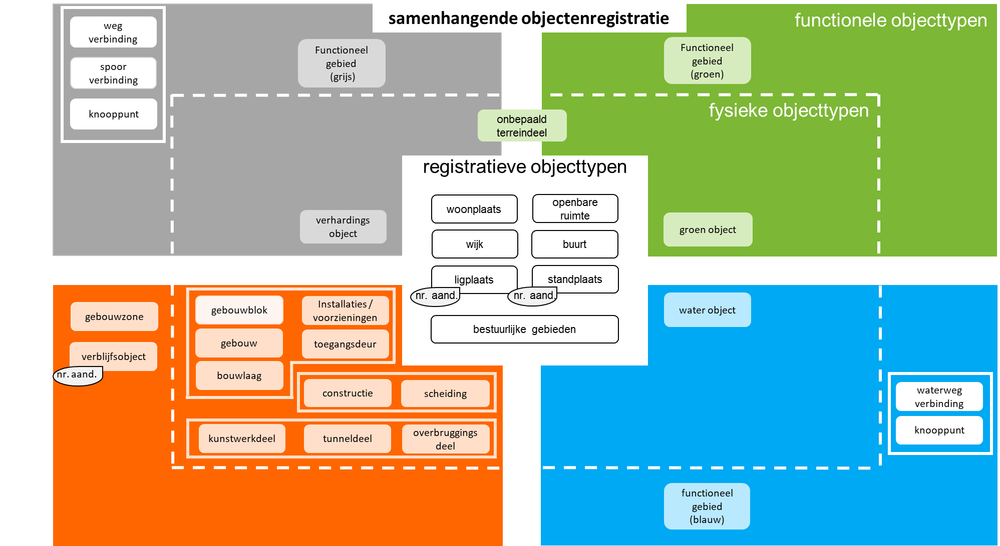

## Beschrijving denkraam samenhangende objectenregistratie

### Hoofdstructuur van de objectenregistratie

Een belangrijk uitgangspunt voor de verdere uitwerking van de inhoud van de SOR is een strikte scheiding tussen fysieke objecttypen en functionele objecttypen. Fysieke objecttypen zijn in de werkelijkheid voorkomende tastbare objecttypen, zoals gebouwen, verharding, water, spoorlijnen en bomen. Fysieke objecttypen worden altijd gedefinieerd door hetgeen in het terrein zichtbaar is. Functionele objecttypen hangen altijd samen met specifieke gebruikersbehoeften of formele afsprakenkaders. De definitie van deze objecttypen wordt dan ook altijd bepaald door hetgeen partijen hierover gezamenlijk vastleggen zonder dat dit altijd direct te relateren is aan in het terrein zichtbare onderdelen. Denk aan objecttypen als een park, een carpoolplaats of een waterbergingsgebied, waarvan de begrenzing niet direct tastbaar in het terrein is te constateren, maar volledig wordt bepaald door de exacte afspraken die daarover zijn gemaakt (zoals: hoort de berm van de carpoolplaats wel of niet tot de carpoolplaats?).

```Voorbeeld: Van een weg wordt de verharding, bijvoorbeeld asfalt of gebakken klinkers, als een verhardingsobject vastgelegd met type ‘asfalt’ of ‘gebakken klinkers’. De functie van die weg wordt vastgelegd als functioneel gebied. Het functionele gebied zal iets zeggen over het gebruik van de weg, dus is het een ‘rijbaan autosnelweg’ of is het een ‘rijbaan lokale weg’. Maar het kan ook iets zeggen over bijvoorbeeld de weggebruikers die van deze weg gebruik mogen maken, zoals ‘auto’, ‘fietser’ en/of ‘voetganger’. Daarmee zijn er voor een weg dus al twee verschillende functionele indelingen die algemeen gebruikt worden. ```


De mate waarin er ruimte bestaat om als bronhouder de begrenzing van functionele objecttypen te bepalen wordt in de praktijk in een aantal gevallen beperkt omdat de functionele begrenzing van deze objecten voortvloeit vanuit formele besluiten hierover door een bestuursorgaan. De in deze besluiten opgenomen begrenzingen zullen dan één op één moeten worden overgenomen in de registratie. Bij de andere functionele objecttypen zal de begrenzing van objecten primair worden bepaald door het toepassen van afsprakenkaders en afbakeningsregels door de bronhouder van het betreffende objecttype in de basisregistratie. Om die reden wordt er in de verdere uitwerking van de objectenregistratie een nader onderscheid gemaakt tussen functionele objecten waarvan de afbakening en benoeming plaatsvindt op basis van formele regelgeving of besluiten en de overige functionele objecten. De eerste categorie zullen we hierna verder aanduiden als registratieve objecttypen.

In het denkraam voor de samenhangende objectenregistratie zijn de objecttypen dus gecategoriseerd naar:

-	Fysieke objecttypen 
-	Functionele objecttypen 
-	Registratieve objecttypen

Deze ordening in drie categorieën kan als volgt worden gevisualiseerd:

Het onderscheid in de verschillende kleuren, grijs (verharding), groen, blauw (water) en oranje (bebouwing) is puur bedoeld voor de beeldvorming en is verder van geen betekenis voor het informatiemodel

Hieronder zijn eerste definities opgenomen van de verschillende in het kader van de samenhangende objectenregistratie onderscheiden fysieke objecttypen, functionele objecttypen en registratieve objecttypen. Het uitgangspunt voor deze definities vormen de in de bestaande basisregistraties gehanteerde definities. Vanwege een strikte scheiding tussen fysieke objecttypen en functionele objecttypen zijn deze definities soms op onderdelen aangepast. Waar mogelijk is de aansluiting gezocht op de aangescherpte definities die momenteel in het kader van de vernieuwing van NEN 3610 (basismodel geo-informatie) worden ontwikkeld. Bij enkele objecttypen is gebruik gemaakt van eerste voorlopige definities die door de werkgroepen zijn opgesteld.

### Fysieke objecttypen

Fysieke objecttypen zijn in de werkelijkheid voorkomende zichtbare en tastbare objecten. Daaronder verstaan we dus objecttypen zoals gebouwen, verharding, water, spoorlijnen en bomen. In het verplichte en gestandaardiseerde deel van de SOR is op maaiveldniveau het grondgebied van Nederland voor de actuele situatie voor 100% bedekt met vlakken die onderdeel uitmaken van een fysiek object. Dat fysiek object kan uitsluitend een object van één van de hieronder benoemde opdelende objecttypen zijn. Objecten mogen elkaar op maaiveldniveau niet overlappen en dienen naadloos op elkaar aan te sluiten. Er mogen op maaiveld niveau ook geen gaten tussen fysieke objecttypen voorkomen. Wanneer objecten boven of onder elkaar liggen, bijvoorbeeld bij een viaduct, liggen ze op verschillende niveaus en kunnen fysieke objecten elkaar wel overlappen. De geometrische vastlegging van fysieke objecttypen kan afhankelijk van het objecttype plaatsvinden in de vorm van een punt, een lijn, een vlak of een volume (3D-object).

Tot de opdelende fysieke objecttypen worden de volgende objecttypen (met de daarbij behorende voorlopige definities) gerekend: 

-	Verhardingsobject
In één of meer lagen aangelegd materiaal, welke zijn gelegd over een ondergrond of onderliggende constructie, aangelegd om een oppervlakte geschikt te maken voor het beoogde gebruik, door te egaliseren, te verstevigen en/of te verruwen. 
(herkomst definitie: Voorstel NEN3610)

-	Groenobject
Op basis van type begroeiing, beplanting, natuurlijk voorkomen of morfologische aspecten getypeerd stuk aardoppervlak (herkomst definitie: Voorstel NEN3610)

-	Onbepaald terreindeel 
Fysiek begrensd en zichtbaar terreindeel dat bij een gebouw hoort, dat niet nader wordt ingewonnen en dat bestaat uit een mengvorm van begroeiing, verharding, en/of water. (eerste versie van definitie voor SOR gebaseerd op definitie erf uit BGT)

-	Waterobject
Grondoppervlak permanent of periodiek bedekt met water. (herkomst definitie: Voorstel NEN3610)

-	Gebouwblok
Grootste aaneengesloten samenstel van gebouwen die bouwkundig-constructief met elkaar verbonden zijn. (herkomst eerste globale aanzet van een definitie: eindrapport werkgroep bouwwerken)

-	Gebouw
Grootste, aaneengesloten, homogene, duurzaam met de aarde verbonden en omsloten bouwkundige eenheid binnen een Gebouwblok. (herkomst eerste globale aanzet van een definitie: eindrapport werkgroep bouwwerken)

-	Bouwlaag
De verzameling Ruimten op hetzelfde niveau binnen een Gebouw. (herkomst eerste globale aanzet van een definitie: eindrapport werkgroep bouwwerken)

-	Installatie / voorziening
Geheel van relevante installaties of andere voorzieningen in of aan en ten dienste van het Gebouw (herkomst eerste globale aanzet van een definitie: eindrapport werkgroep bouwwerken)

-	Toegangsdeur
Deur of andere voorziening die vanaf de openbare weg, een erf of een gedeelde verkeersruimte toegang geeft tot een Gebouw of Verblijfsobject. (herkomst eerste globale aanzet van een definitie: eindrapport werkgroep bouwwerken)

-	Constructie 
Overige bouwwerken niet zijnde een Gebouw. (eerste versie van definitie voor SOR)

-	Kunstwerkdeel
Onderdeel van een civieltechnisch werk voor de infrastructuur van wegen, water, spoorbanen, waterkeringen en/of leidingen. (herkomst definitie: BGT 1.1.1)

-	Tunneldeel
Onderdeel van een kunstmatig aangelegde, kokervormige onderdoorgang dat essentieel is voor de constructie. (herkomst definitie: BGT 1.1.1)

-	Overbruggingsdeel 
Onderdeel van een beweegbare of vaste verbinding tussen twee punten, die door water, een weg of anderszins gescheiden zijn, dat essentieel is voor de constructie. (herkomst definitie: BGT 1.1.1)

-	Scheiding
Kunstmatig, meestal lineair obstakel met een werend karakter (herkomst definitie: gebaseerd op BGT 1.1.1)

### Functionele objecttypen

Functionele objecttypen zijn objecttypen waarvan de begrenzing altijd wordt bepaald door hetgeen partijen hierover gezamenlijk vastleggen zonder dat dit altijd direct te relateren is aan in het terrein zichtbare onderdelen. Daaronder verstaan we dus objecttypen als een park, een carpoolplaats en een waterbergingsgebied. Omdat functionele objecttypen sterk afhankelijk zijn van één of meerdere gebruikersgroepen, kunnen meerdere functionele objecttypen boven, onder of naast elkaar voorkomen op dezelfde locatie. Een speelplaats kan bijvoorbeeld bij noodweer ook dienen als waterbergingsgebied. Geometrische vastlegging van functionele objecttypen kan in de vorm van een punt, een lijn, een vlak of een volume (3D-object). Denk hierbij aan verblijfsobjecten (punt), netwerken (lijn) en functionele gebieden (vlak).

Deze functionele gebieden (vlak) zijn niet landsdekkend. Dit betekent dat ongeacht het niveau, maaiveld of onder/boven maaiveld, functionele objecten het grondgebied van Nederland niet voor 100% bedekken. Objecten mogen elkaar dus overlappen en er mogen gaten voorkomen. In de SOR worden uitsluitend functionele objectentypen opgenomen die van belang zijn voor meerdere gebruikers in verschillende overheidsdomeinen.

Functionele objecttypen in de objectenregistratie zijn:
-	Functioneel gebied
Door functie of gebruik begrensd gebied. (herkomst definitie: Voorstel NEN3610)

-	Netwerken voor wegen, water en spoor
Een samenhangend stelsel van aan elkaar gesloten wegen, spoorwegen, water- en vaarwegen waardoor vlotte verplaatsing tussen twee locaties mogelijk is. Waar van toepassing middels de beoogde modaliteit. Dit is opgebouwd uit verbindingen en knooppunten. (herkomst definitie: Voorstel NEN3610)

-	Verblijfsobjecten
De kleinste binnen een of meer panden gelegen en voor woon-, bedrijfsmatige, of recreatieve doeleinden geschikte eenheid van gebruik die ontsloten wordt via een eigen afsluitbare toegang vanaf de openbare weg, een erf of een gedeelde verkeersruimte, onderwerp kan zijn van goederenrechtelijke rechtshandelingen en in functioneel opzicht zelfstandig is. (herkomst definitie: Artikel 1 Wet basisregistratie adressen en gebouwen)

-	Gebouwzone
Het grootst mogelijke gedeelte van een bouwwerk dat in zijn geheel is gelegen op een bouwlaag en binnen de afbakening van een gebouw en een verblijfsobject, waaraan eenduidig een bouwjaar kan worden toegekend, en dat qua constructie en gebruiksmogelijkheden voldoende uniform is. (herkomst eerste globale aanzet van een definitie: eindrapport werkgroep bouwwerken)


## Registratieve objecttypen

Registratieve objecttypen zijn objecttypen waarvan de afbakening en benoeming plaatsvindt op basis van formele regelgeving of besluiten. Het gaat vaak om gebieden waarin sprake is van een eenheid van politiek/bestuurlijke verantwoordelijkheid. Denk hierbij aan de begrenzing van provincies en gemeenten. Maar het kan ook gaan om ruimtelijke objecttypen waarvan het bestaan voortvloeit vanuit hetgeen in een besluit daarover wordt bepaald. Voorbeelden hiervan zijn gemeentelijke besluiten waarin woonplaatsen worden aangewezen, en stand- en ligplaatsen (volgens de Wet BAG) worden benoemd. 
Geometrische vastlegging van registratieve objecttypen vindt plaats in de vorm van een lijn of een vlak.
Registratieve objecttypen in de objectenregistratie zijn:

-	Woonplaats
Een door het bevoegde gemeentelijke orgaan als zodanig aangewezen en van een naam voorzien gedeelte van het grondgebied van de gemeente. (herkomst definitie: Artikel 1 Wet basisregistratie adressen en gebouwen)

-	Openbare ruimte
Een door het bevoegde gemeentelijke orgaan als zodanig aangewezen en van een naam voorziene buitenruimte die binnen één woonplaats is gelegen. (herkomst definitie: Artikel 1 Wet basisregistratie adressen en gebouwen)

-	Nummeraanduiding
Een door het bevoegde gemeentelijke orgaan als zodanig toegekende aanduiding van een verblijfsobject, een standplaats of een ligplaats. (herkomst definitie: Artikel 1 Wet basisregistratie adressen en gebouwen)

-	Ligplaats
Een door het bevoegde gemeentelijke orgaan als zodanig aangewezen plaats in het water al dan niet aangevuld met een op de oever aanwezig terrein of een gedeelte daarvan, die bestemd is voor het permanent afmeren van een voor woon-, bedrijfsmatige of recreatieve doeleinden geschikt drijvend object. (herkomst definitie: Artikel 1 Wet basisregistratie adressen en gebouwen)

-	Standplaats
Een door het bevoegde gemeentelijke orgaan als zodanig aangewezen terrein of gedeelte daarvan dat bestemd is voor het permanent plaatsen van een niet direct en niet duurzaam met de aarde verbonden en voor woon-, bedrijfsmatige, of recreatieve doeleinden geschikte ruimte. (herkomst definitie: Artikel 1 Wet basisregistratie adressen en gebouwen)

-	Wijk
Een door het bevoegde gemeentelijke orgaan als zodanig afgebakend gebied, aangewezen en van naam voorzien, dat geldt als eenheid van politiek/bestuurlijke verantwoordelijkheid of voor bedrijfsvoering en een cluster is van buurten (eerste versie van definitie voor SOR)

-	Buurt
Een door het bevoegde gemeentelijke orgaan als zodanig afgebakend gebied, aangewezen en van naam voorzien, dat als kleinste eenheid geldt van politiek/bestuurlijke verantwoordelijkheid of voor bedrijfsvoering. (eerste versie van definitie voor SOR)

-	Rijk
Het Europese grondgebied van het Koninkrijk der Nederlanden inclusief de daarbij behorende territoriale wateren (eerste versie van definitie voor SOR)

-	Provincie
Een door het parlement als provincie in een wet benoemd gedeelte van het Nederlands grondgebied (eerste versie van definitie voor SOR) 

-	Gemeente
Een door het parlement als gemeente in een wet benoemd gedeelte van het Nederlands grondgebied (eerste versie van definitie voor SOR)
 
-	Waterschap
Een door het bevoegde provinciale orgaan als zodanig afgebakend gebied, aangewezen en van naam voorzien, dat als eenheid geldt van politiek/bestuurlijke verantwoordelijkheid voor beheer van het water en de waterstaatszorg. (eerste versie van definitie voor SOR)

Overwogen wordt ook de bebouwde komgrens in de samenhangende objectenregistratie op te nemen.

## Hoofdinvulling samenhangende objectenregistratie

Opname van de verschillende hiervoor gedefinieerde objecttypen in de eerder gepresenteerde ordening van objecttypen naar fysieke objecttypen, functionele objecttypen en registratieve objecttypen enerzijds en naar hoofdsoorten (verharding, groen, water en bebouwing) anderzijds, levert de volgende hoofdinvulling van de samenhangende objectenregistratie op:


