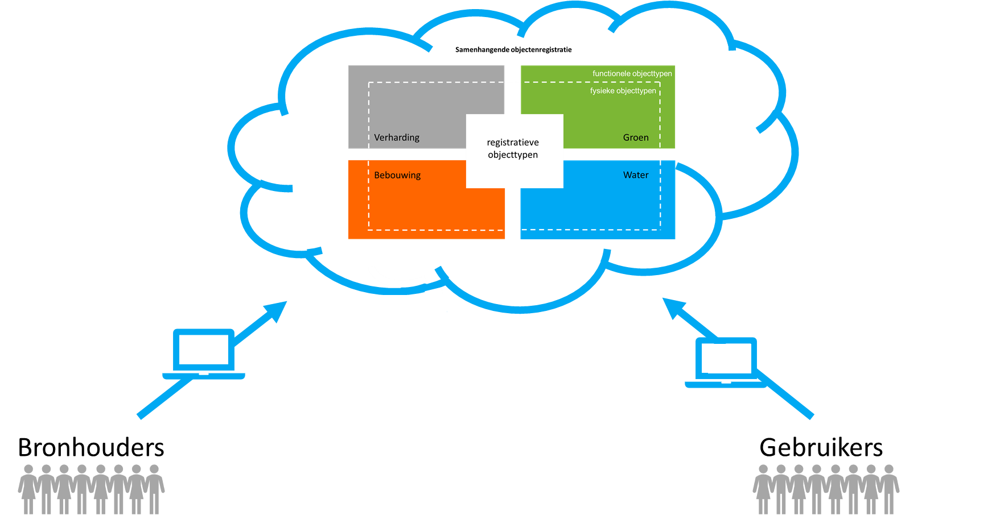

## Inleiding 

*Hier de inleiding, een generieke tekst over het onderwerp van het rapport, de omgeving van eht rapport, enz ...* 

### Aanleiding

In Nederland wordt heel veel informatie bijgehouden over objecten die we buiten in het terrein aantreffen. Bij die objecten kan worden gedacht aan wegen, water, gebouwen, spoorlijnen en bomen. Een deel van de over deze objecten vastgelegde informatie is alleen van belang voor heel specifieke toepassingen. Denk hierbij bijvoorbeeld aan het aantal keren dat een grasveld per jaar wordt gemaaid (maai-regiem). Deze informatie is in het algemeen niet voor iedereen van belang. Er is echter ook informatie die breed wordt gebruikt. Denk dan bijvoorbeeld aan het bouwjaar van een gebouw. 

Op dit moment zijn veel van deze breder gebruikte gegevens over objecten verspreid over verschillende registraties. Het gaat daarbij zowel om registraties die de status van basisregistratie hebben gekregen, als om registraties waarin gegevens over deze objecten ten behoeve van een specifieke toepassing of ten behoeve van gebruik binnen een bepaalde sector zijn vastgelegd. De belangrijkste basisregistraties waarin informatie over fysieke objecten is opgenomen zijn de Basisregistratie Adressen en Gebouwen (BAG), de Basisregistratie Grootschalige Topografie (BGT), de Basisregistratie Waardering Onroerende Zaken (WOZ) en de Basisregistratie Topografie (BRT). Voorbeelden van andere registraties waarin gegevens over fysieke objecten zijn opgenomen zijn de registraties voor het Beheer van de Openbare Ruimte (BOR-registraties), Nationaal Wegenbestand (NWB) en het Actueel Hoogtebestand Nederland (AHN).

Elk van deze registraties kent op dit moment een eigen informatiemodel. Tussen verschillende van deze informatiemodellen heeft in de loop van de jaren afstemming plaatsgevonden. Toch is er nog steeds sprake van een gebrekkige aansluiting tussen deze verschillende informatiemodellen. Met de samenhangende objectenregistratie (SOR) wordt beoogd om meer samenhang aan te brengen tussen de verschillende objecttypen en de eigenschappen die daarover worden bijgehouden. Hiermee kunnen bijhoudingsprocessen worden vereenvoudigd, de informatievoorziening flexibeler worden opgezet en de wensen van gebruikers om meer samenhangende informatie worden ingewilligd.

### Waarop is het conceptueel denkraam gebaseerd?

Vanaf 2017 wordt er gewerkt aan de verdere beeldvorming over de inhoud en werking van een dergelijke samenhangende objectenregistratie. Daarbij zijn vanuit een kerngroep objectenregistratie eerste denkbeelden ontwikkeld over onder meer de context waarin een dergelijke registratie functioneert en de doelstellingen  die met een dergelijke registratie zouden moeten worden bereikt. 
Deze doelstellingen zijn:
1. Een betrouwbare, consistente en actuele samenhangende gegevensset voor heel Nederland;
1. Een efficiëntere inwinning en bijhouding van objecten, ook in drie dimensies (3D); 
1. Een betere inpassing in moderne architecturen; 
1. Meer en eenvoudiger gebruik van deze informatie in maatschappelijke toepassingen, waarbij de registratie zich voor de gebruiker gedraagt als één registratie; 
1. Een onderdeel van een robuuste geo-informatie infrastructuur binnen de generieke digitale infrastructuur en voldoend aan de 12 eisen voor een basisregistratie.

Ook is nagedacht over de wijze waarop de ontwikkeling van een dergelijke registratie zou moeten plaatsvinden uitgaande van de bestaande situatie en de behoefte een dergelijk traject beheersbaar te houden. Verder zijn er ook een aantal globale uitgangspunten geformuleerd voor het gegevensmodel van een samenhangende objectenregistratie, het voorziene inwinnings- en productieproces en de (architectuur van de) ontsluiting van gegevens. Tenslotte zijn ook eerste beelden ontwikkeld over de organisatie en governance en over de financiering. De resultaten van dit traject zijn vastgelegd in een beleidsvisie (schetsontwerp) voor een samenhangende objectenregistratie. Deze is eind november 2019 door het BAG BAO en de Regieraad BGT vastgesteld.

Naast het uitwerken van algemene denkbeelden over de contouren van een dergelijke registratie, zijn er ook verkenningen uitgevoerd naar de mogelijke inhoud van onderdelen van de registratie. Hiervoor zijn interbestuurlijke werkgroepen voor de onderwerpen bouwwerken, wegen, water en natuur & landschap aan de gang gegaan. De werkgroepen bouwwerken en wegen hebben eind 2018 al eerste resultaten opgeleverd. De resultaten van de andere werkgroepen en de verdieping van de werkgroep wegen waren in november 2019 beschikbaar. De verdieping van de werkgroep bouwwerken is in februari 2020 verschenen. Alle inhoudelijke verkenningen vormen een belangrijke basis voor de verdere uitwerking van de inhoud van een samenhangende objectenregistratie. In bijlage 4 is voor de verschillende werkgroepen aangegeven op welke wijze is omgegaan met de door hen beschreven aanbevelingen.

Daarnaast zijn in de afgelopen jaren op verschillende momenten wensen van gebruikers van de verschillende registraties opgehaald en hebben bronhouders van verschillende registraties aangegeven welke verbeteringen naar hun mening mogelijk zijn binnen deze bestaande registraties. Een aantal van deze verbeteringen is of wordt meegenomen in de ontwikkeling die de afzonderlijke registraties doormaken. Zo zijn er in het kader van het BAG 2.0 traject enkele wijzigingen doorgevoerd in het bestaande informatiemodel (zoals de introductie van enkele nieuwe statussen voor verbouwingen). Er zijn echter ook een aantal wijzigingsvoorstellen waarvan (veelal gezien de impact) is besloten om deze op een later moment opnieuw te bezien. Bij dit soort impactvolle wijzigingen kan bijvoorbeeld worden gedacht aan de behoefte om in het kader van de BGT een striktere scheiding door te voeren tussen fysieke objecttypen en functionele objecttypen. En aan de wens om geometrie toe te voegen aan openbare ruimten in de BAG. Deze eerder geuite verbeter¬suggesties kunnen en zullen opnieuw worden beschouwd bij  de verdere uitwerking van de inhoud van een objectenregistratie.

Tenslotte zijn er in het kader van de gedachtenvorming over een objectenregistratie ook nog enkele aanvullende behoeften naar voren gekomen. Het gaat hierbij onder meer om de wens om bepaalde typen gebieden een meer uniforme plaats in een basisregistratie te geven. Denk aan een aantal bestuurlijke gebieden (zoals gemeenten met hun begrenzing) en een aantal veelvuldig gebruikte andere gebiedsindelingen (zoals een meer eenduidige registratie van wijken en buurten en van de bebouwde kom). Bij de verdere uitwerking van de inhoud van een samenhangende objectenregistratie wordt met deze wensen rekening gehouden.

### Hoe moet dit conceptueel denkraam worden gezien?

Op basis van deze verschillende behoeften is door een klein aantal experts een eerste versie van een denkraam voor de inhoud van een samenhangende objectenregistratie opgesteld. Deze eerste versie is vervolgens in een steeds grotere groep van experts vanuit verschillende overheidsorganisaties getoetst en verder uitgewerkt. Het resultaat dat dit traject tot op heden heeft opgeleverd is in dit document vastgelegd als een beschrijving van een eerste versie van dit denkraam. Het is daarmee de stolling van de eind 2019 ontwikkelde denkbeelden en daarmee de basis voor de verdere uitwerking en invulling die gedurende 2020 zal plaatsvinden.

Hierbij moeten vooraf enkele opmerkingen worden gemaakt:
- Het gaat nadrukkelijk om een eerste concept voor het denkraam. Het schetst de contouren van de inhoudelijke uitwerking van de objectenregistratie. Hiermee wordt bedoeld dat de uitgangspunten en de verschillende door de interbestuurlijke werkgroepen voorgestelde richtingen zijn vertaald in een zo veel mogelijk samenhangende conceptuele beschrijving van de inhoud. De onderliggende uitgangspunten en voorstellen kennen echter nog een verschillende mate van uitwerking. Daarom is er nog geen sprake van een volledige conceptuele beschrijving van de inhoud. Daarvoor zullen begin 2020 nog verdere stappen worden gezet.
- Bij het opstellen van het conceptueel denkraam is gewerkt vanuit het eveneens in de eerder genoemde beleidsvisie opgenomen uitgangspunt dat het ontwerp van een samenhangende objectenregistratie wordt vormgegeven vanuit een nadrukkelijke scheiding tussen de vastlegging van gegevens en de functionaliteit voor het bewerken, opvragen en presenteren daarvan. Hiermee wordt aangesloten op moderne inzichten over de organisatie van de gegevenshuishouding, zoals deze onder meer worden gehanteerd in het kader van Common Ground (https://commonground.nl/.
- In dit document wordt van de hierbij behorende architectuur van een gegevenslandschap uitsluitend een verdere uitwerking gegeven aan het onderdeel gegevensbronnen (gebaseerd op eenduidige informatiemodellen). Het hieruit samenstellen van verschillende informatieproducten voor gebruikers (zoals specifieke kaartproducten) is niet opgenomen in dit document. Daaraan zal in een latere fase verder uitwerking worden gegeven.
- In dit document wordt zoveel mogelijk gebruik gemaakt van terminologie die aansluit op de wijze waarop hiermee wordt omgegaan in het hier relevante afsprakenstelsel voor informatiemodellering (Zoals het Metamodel Informatiemodellering (MIM) en de Nederlandse Technische Afspraak (NTA) 8035 over semantische Gegevensmodellering en -Integratie in de Gebouwde Omgeving). Dit betekent onder meer dat er wordt gesproken over objecttypen en de eigenschappen daarvan in plaats van over objecten en gegevens. De termen objecten en gegevens worden gebruikt om specifieke exemplaren van objecttypen en eigenschappen aan te duiden. De “Galecopperbrug” is dus een object van het objecttype “overbruggingsdeel” en “2645 GB” is dus een gegeven van de eigenschap “postcode”.
- De samenhangende objectenregistratie is slechts één van de registraties die onderdeel uitmaakt van een gegevenslandschap met daarin verschillende andere registraties, waaronder een groot aantal domeinspecifieke of sectorale geo-registraties. Hierbij is de grondgedachte dat in de samenhangende objectenregistratie objecttypen en eigenschappen daarvan worden vastgelegd die van belang zijn voor gebruik in verschillende overheidsdomeinen. De samenhangende objectenregistratie bevat daarbij aanhaakpunten (in de vorm van identificatiecodes) waaraan andere registraties kunnen koppelen. De samenhangende objectenregistratie fungeert daarmee als een verbindende schakel tussen de verschillende specifieke eigenschappen die van deze objecttypen zijn geregistreerd in de verschillende sectorale registraties. Hiermee bevordert de samenhangende objectenregistratie indirect ook de samenhang met in die sectorale registraties opgenomen specifieke objecttypen en eigenschappen daarvan.
- Met dit document wordt beoogd om de uitgangspunten over, de samenhang tussen en de betekenis van de in de objectenregistratie te onderscheiden objecttypen te beschrijven. Op een aantal punten leidt dat tot een iets andere ordening van de objecttypen binnen het conceptueel model dan op dit moment het geval is. Hiermee kan op onderdelen de suggestie ontstaan dat het bijhouden van en het gebruiken van gegevens  veel complexer wordt. De verwachting is echter dat dit niet het geval zal zijn. De striktere ordening van een aantal objecttypen in het model zal leiden tot een flexibeler en daarmee uiteindelijk beter te beheren en te gebruiken registratie. Veel van de wijzigingen in het conceptueel model zullen daarbij naar verwachting uiteindelijk voor degenen die de registratie bijhouden slechts beperkt zichtbaar zijn, omdat deze door een herschikking van functionaliteit in de gebruikte software kunnen worden opgevangen. Gebruikers kunnen worden voorzien van zowel informatieproducten die aansluiten op de huidige producten als nieuwe informatieproducten waarmee optimaal wordt geprofiteerd van de wijzigingen in het conceptueel model(zie onderstaande figuur).

### Leeswijzer

In hoofdstuk 2 wordt een opsomming gegeven van de verschillende uitgangspunten die worden gehanteerd bij de verdere uitwerking van het conceptueel informatiemodel. Deze uitgangspunten hebben zowel betrekking op de grondgedachten van de samenhangende objectenregistratie als op de in het informatiemodel op te nemen objecttypen en eigenschappen.

De verschillende objecttypen worden in hoofdstuk 3 op hoofdlijnen uitgewerkt. Daarbij worden de objecttypen opnieuw geordend en voorzien van een eerste aanzet van een definitie. Veelal zal het hierbij gaan om dezelfde of aangescherpte definities van objecttypen, zoals deze ook in de huidige basisregistraties al worden gehanteerd.

In hoofdstuk 4 is een eerste aanzet opgenomen van een aantal hoofdtyperingen die behoren bij enkele objecttypen.

Om hetgeen in deze beschrijving is opgenomen beter te kunnen relateren aan hetgeen in de bestaande basisregistraties is opgenomen, bevat hoofdstuk 5 een globale mapping van de objecttypen uit de bestaande basisregistraties op de samenhangende objectenregistratie.

In hoofdstuk 6 is de inrichting van het vervolgtraject beschreven.

