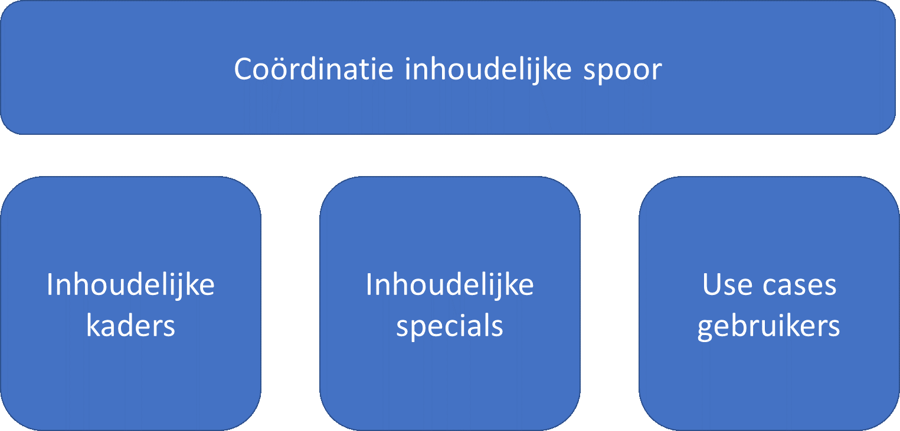

## Inrichting van het vervolg

In dit document zijn de hoofdlijnen beschreven van de inhoud van een samenhangende objectenregistratie. Deze beschrijving bevat nog tal van uitwerkpunten die noodzakelijk zijn om te komen tot een gedetailleerd conceptueel informatiemodel. Dit betekent dat in de vervolgfase in elk geval sturing zal moeten worden gegeven aan deze verdere inhoudelijke detailuitwerkingen. Daarnaast is het noodzakelijk dat bewaakt wordt dat deze verschillende detailuitwerkingen blijven passen in een samenhangend conceptueel informatiemodel. Ook zijn enkele meer algemene punten rondom het conceptueel model van een samenhangende objectenregistratie gesignaleerd, die een nadere uitwerking behoeven. Tenslotte wordt er groot belang gehecht aan het in een vroegtijdig stadium toetsen van de inhoud van een samenhangende objectenregistratie aan de concrete behoeften die er bestaan bij gebruikers vanuit een aantal specifieke use-cases. Samengevat gaat het in de vervolguitwerking van de inhoud van de samenhangende objectenregistratie dus om de volgende hoofdelementen:

In dit hoofdstuk wordt nader ingegaan op de eerste beelden die er bestaan bij de noodzakelijke verdere uitwerking van deze hoofdelementen in het vervolgtraject.

### Inhoudelijke uitwerkingspunten
Bij het opstellen van het denkraam is geconstateerd dat er minimaal een verdere uitwerking zal moeten plaatsvinden van een aantal onderwerpen. Deze onderwerpen zijn hieronder geordend naar enerzijds het eerder in dit document gemaakte onderscheid naar een drietal hoofdgroepen van objecttypen (fysieke objecttypen, functionele objecttypen en registratieve objecttypen) en anderzijds naar een onderscheid in uitwerkpunten die betrekking hebben op kaders, objecttypen en eigenschappen. Dat levert op basis van de huidige inzichten het volgende eerste overzicht van inhoudelijke uitwerkingspunten op:

|	            |Kaders	                      |Objecttypen	                   |Eigenschappen|
|---------------|-----------------------------|--------------------------------|-------------|
|**Algemeen**	|Plaats aggregatie en uiteenrafelen in het model	|Uitwerking kader levensfasen objecten	    |Uitwerking identificatiecode objecten|
|               |Verdere uitwerking hoofdstructuur                  |Uitwerken mate van detail (schaalniveau)	|Uitwerking eerste overzicht gegevens|
|               |Uitwerking historiemodel		                    |                                           |Uitwerking 3D (afstemming)|
|               |Uitwerking meta-informatie (MIM) zoals kwaliteit	|                                           |Omgang met bronverwijzing (zoals PBP's)|
|---------------|-----------------------------|--------------------------------|-------------|
|**Fysieke objecten**	|Uitwerking criterium maaiveld 100%	        |Uitwerking objectenmodel gebouwen 	        |Typering gebouwen |
|               |Uitwerking criterium ondergrondse delen	        |Uitwerking kunstwerken, tunnels en overbruggingen 	|Typering verhardingsobject|
|               |Uitwerking grondgebied Nederland	                |Uitwerking scheiding	                    |Typering groenobject|
|               |Aanscherping definitie opdelende objecttypen	    |Fysieke begrenzing water	                |Typering waterobject|
|               |Uitwerking inrichtingselementen		|||
|               |Uitwerking samenhang met BRT objecten		|||
|---------------|-----------------------------|--------------------------------|-------------|
|**Functionele objecten**	|Aanscherping definitie functionele objecttypen	|Uitwerking objectenmodel gebouwen 	|Typering functionele gebieden|
|               |Uitwerking eerste lijst functionele gebieden	    |Uitwerking keringen 	                    |Typering functionele gebieden verharding|
|               |Uitwerking samenhang met BRT objecten	            |Uitwerking netwerken als onderdeel registratie 	|Typering functionele gebieden groen|
|               |                                                   |Functionele gebieden natuur	                    Typering functionele gebieden water|
|---------------|-----------------------------|--------------------------------|-------------|
|**Registratieve objecten**	|Uitwerking samenhang met BRT objecten  |Uitwerking openbare ruimten geometrie	    |Typering registratieve gebieden|
|               |                                                   |Naamgeving andere objecten 	||
|               |                                                   |Wijken, buurten en territoriale indelingen	||
|               |                                                   |Uitwerking bebouwde kom	||
|               |                                                   |Bestuurlijke gebieden|	|

Hierbij is het de verwachting dat bij de verdere uitwerking van de inhoud er nog aanvullende uitwerkingspunten naar voren zullen komen. Het bovenstaande overzicht van inhoudelijke uitwerkingspunten zal dan ook periodiek worden aangepast.

## Organisatie van de verdere uitwerking

### coördinatie inhoudelijk spoor
De hierboven genoemde inhoudelijke uitwerkingspunten zullen op verschillende tafels, in verschillende samenstellingen en op verschillende momenten worden opgepakt. Het is daarom belangrijk dat de verschillende inhoudelijke uitwerkingen onderling op elkaar blijven aansluiten. Een belangrijk aandachtspunt in het vervolgtraject is dan ook de coördinatie van de verschillende uitwerkingsactiviteiten. Deze coördinatie betekent concreet:

- Het initiëren van de concrete uitwerking door betrokken partijen;
- Het aanjagen van de voortgang van deze uitwerkingsactiviteiten;
- Het bewaken van de aansluiting op geformuleerde uitgangspunten;
- Het bevorderen van de onderlinge consistentie van de verschillende uitwerkingen.

De coördinatie van het inhoudelijk spoor zal formeel plaatsvinden vanuit de werkgroep inhoud. In de praktijk zal dit betekenen dat een aantal deelnemers aan deze werkgroep zorgdragen voor de dagelijkse uitvoering van deze coördinatie.

####inhoudelijke kaders
In het bovenstaande overzicht zijn een aantal algemene onderwerpen en inhoudelijke kaders benoemd die om een nadere uitwerking vragen. Deze voorbereiding van deze uitwerking zal plaatsvinden door enkele deelnemers van de werkgroep inhoud, waarbij naar gelang het onderwerp eventueel ook andere deskundigen worden aangehaakt. In alle gevallen zullen de resultaten in de werkgroep inhoud worden besproken. Het gaat in ieder geval om de volgende onderwerpen:

|	            |Kaders	                      |Objecttypen	                   |Eigenschappen|
|---------------|-----------------------------|--------------------------------|-------------|
|**Algemeen**	|Plaats aggregatie en uiteenrafelen in het model	|Uitwerking kader levensfasen objecten	    |Uitwerking identificatiecode objecten|
|               |Verdere uitwerking hoofdstructuur                  |Uitwerken mate van detail (schaalniveau)	|Uitwerking eerste overzicht gegevens|
|               |Uitwerking historiemodel		                    |                                           |Uitwerking 3D (afstemming)|
|               |Uitwerking meta-informatie (MIM) zoals kwaliteit	|                                           |Omgang met bronverwijzing (zoals PBP's)|
|---------------|-----------------------------|--------------------------------|-------------|
|**Fysieke objecten**	|Uitwerking criterium maaiveld 100%	        |     | |
|               |Uitwerking criterium ondergrondse delen	        |	||
|               |Uitwerking grondgebied Nederland	                |          ||
|               |Aanscherping definitie opdelende objecttypen	    |    ||

Hierbij wordt met de verschillende onderwerpen globaal het volgende bedoeld:
- **Plaats aggregatie en uiteenrafelen in het model** : 
het bepalen hoe wordt omgegaan met geaggregeerde objecttypen zoals een gebouwblok (leggen we deze vast als objecttype of vindt afleiding plaats door middel van logica) en de mate waarin geaggregeerde objecten terug te herleiden moeten zijn tot specifieke objecten;
- **Verdere uitwerking hoofdstructuur** : 
een complete samenhangende beschrijving van alle uitgangspunten voor objecttypen en eigenschappen die onderdeel uitmaken van het conceptueel model van de samenhangende objectenregistratie als basis voor de verdere uitwerking van het informatiemodel;
- **Uitwerking historiemodel** : 
analyse van de bestaande wijze van omgang met onder meer materiële en formele historie, de daarbij behorende tijdslijnen en de wijze waarop hiermee in het kader van de samenhangende objectenregistratie zal worden omgegaan;
- **Uitwerking meta-informatie (zoals kwaliteit)** : 
het op basis van hiervoor bestaande modellen (zoals MIM en andere normen) uitwerken op welke wijze meta-informatie in de samenhangende objectenregistratie wordt vormgegeven (waarbij er onder meer aandacht wordt geschonken aan het vastleggen van kwaliteitskenmerken van gegevens, rekening houdend met de wijze waarop dit op dit moment in de registraties is vormgegeven);
- **Uitwerking criterium maaiveld 100%** : 
nadere uitwerking van de wijze waarop invulling wordt gegeven aan het criterium maaiveld in termen van consistentieregels en de wijze van omgang met het maaiveldprincipe in het geval van 3D objecten;
- **Uitwerking criterium ondergrondse delen** : 
uitwerking van de exacte afbakeningsregels voor ondergrondse delen (van welke objecttypen worden welke ondergrondse delen vastgelegd) en op welke wijze worden ondergrondse delen in de registratie opgenomen (met aandacht voor een invulling via niveauverschillen en 3D  geometrie);
- **Uitwerking grondgebied Nederland** : 
er zal moeten worden bepaald of en op welke wijze het grondgebied van Nederland voor de samenhangende objectenregistratie zal worden afgebakend (continentaal plat in de Noordzee en de overzeese gebiedsdelen);
- **Aanscherpen definitie opdelende objecttypen** : 
een exacte beschrijving van alle opdelende objecttypen en de daarbij behorende afbakeningsregels op basis van een gedetailleerde afstemming op andere informatiemodellen (zoals de nieuwe NEN 3610 en sectorale informatiemodellen);
- **Uitwerken kader levensfasen objecten** : 
een nadere uitwerking van de wijze waarop in de samenhangende objectenregistratie invulling kan worden gegeven aan de verschillende levensstadia waarin objecten kunnen fungeren (met enerzijds aandacht voor algemene voor alle objecttypen geldende uitgangspunten en anderzijds een verbijzondering daarvan voor enkele specifieke objecttypen);
- **Uitwerken mate van detail (schaalniveau)** : 
analyse van de vraagstukken die samenhangen met een schaalloze wijze van inwinning (kwaliteitseisen kunnen een andere mate van detail kennen dan de detaillering waarmee gegevens in een schaalloze registratie worden opgenomen) en een eerste vertaling hiervan naar kwaliteitseisen;
- **Uitwerken identificatiecode van objecten** : 
analyse van de wijze waarop in de huidige registraties wordt omgegaan met identificatiecodes, gewenste vernieuwingen daarin (met aandacht voor lopende verkenningen vanuit BZK) en het komen tot een eerste voorstel voor een meer uniforme wijze van omgang met identificatiecodes (inclusief een eventueel globale transitiestrategie);
- **Uitwerking eerste overzicht van eigenschappen** : 
het verzamelen en samenhangend beschrijven van de verschillende eigenschappen die van de verschillende objecttypen zullen worden geregistreerd;
- **Uitwerking 3D** : 
nadere inhoudelijke afstemming met de verschillende ontwikkelingen die er lopen rondom 3D gericht op het op een juiste wijze in het conceptueel model opnemen van 3D eigenschappen van objecttypen;
- **Omgang met bronverwijzing** : 
nadere uitwerking van de wijze waarop binnen de samenhangende objectenregistratie op een uniforme wijze een verwijzing kan plaatsvinden naar bronnen waarop objecten of gegevens zijn gebaseerd (zoals brondocumenten of plaatsbepalingspunten) en de wijze waarop hiervoor voor verschillende objecttypen differentiatie kan plaatsvinden.

#### Inhoudelijke specials
Bij het opstellen van deze eerste beschrijving van de inhoud van de objectenregistratie zijn ook tal van specifieke uitwerkpunten benoemd, die noodzakelijk zijn om te komen tot een gedetailleerd conceptueel informatiemodel. Deze uitwerking zal plaatsvinden door of met experts vanuit verschillende domeinen en organisaties. Hierbij wordt van enkele uitwerkingspunten verwacht dat deze een dusdanige complexiteit kennen, dat het wenselijk is hiervoor een tijdelijke detailwerkgroep in te stellen, die in opdracht van de werkgroep inhoud bepaalde inhoudelijke onderwerpen verder uitwerkt. Van andere onderwerpen wordt verwacht dat deze (na een goede voorbereiding in kleiner verband) in voldoende mate kunnen worden uitgewerkt binnen bijvoorbeeld een eenmalige werksessie met de meest betrokken experts. Het gaat daarbij op dit moment dus om de volgende onderwerpen:

|	            |Kaders	                      |Objecttypen	                   |Eigenschappen|
|---------------|-----------------------------|--------------------------------|-------------|
|**Algemeen**	|                             |	                               |             |
|---------------|-----------------------------|--------------------------------|-------------|
|**Fysieke objecten**	| |Uitwerking objectenmodel gebouwen 	        |Typering gebouwen |
|               |	      |Uitwerking kunstwerken, tunnels en overbruggingen 	|Typering verhardingsobject|
|               |         |Uitwerking scheiding	                    |Typering groenobject|
|               |	    |Fysieke begrenzing water	                |Typering waterobject|
|               |Uitwerking inrichtingselementen		|||
|               |Uitwerking samenhang met BRT objecten		|||
|---------------|-----------------------------|--------------------------------|-------------|
|**Functionele objecten**	|Aanscherping definitie functionele objecttypen	|Uitwerking objectenmodel gebouwen 	|Typering functionele gebieden|
|               |Uitwerking eerste lijst functionele gebieden	    |Uitwerking keringen 	                    |Typering functionele gebieden verharding|
|               |Uitwerking samenhang met BRT objecten	            |Uitwerking netwerken als onderdeel registratie 	|Typering functionele gebieden groen|
|               |                                                   |Functionele gebieden natuur	                    Typering functionele gebieden water|
|---------------|-----------------------------|--------------------------------|-------------|
|**Registratieve objecten**	|Uitwerking samenhang met BRT objecten  |Uitwerking openbare ruimten geometrie	    |Typering registratieve gebieden|
|               |                                                   |Naamgeving andere objecten 	||
|               |                                                   |Wijken, buurten en territoriale indelingen	||
|               |                                                   |Uitwerking bebouwde kom	||
|               |                                                   |Bestuurlijke gebieden|	|

De organisatorische invulling van deze specifieke inhoudelijke uitwerkingen zal in een afzonderlijk document nog verder worden geconcretiseerd.

#### Use cases gebruikers
Het is belangrijk om in een vroegtijdig stadium te toetsen in hoeverre de inhoud van een samenhangende objectenregistratie voldoet aan de concrete behoeften die er bestaan bij de verschillende soorten gebruikers. Eén van de onderdelen van het vervolgtraject is dan ook het aan de hand van specifieke gebruikerssituaties (use-cases) bepalen of de voorgestelde objecttypen en eigenschappen voldoende aansluiten op hetgeen de gebruikers toepassen in hun eigen informatievoorziening. De samenhangende objectenregistratie is daarbij uiteraard niet de enige gegevensbron die wordt gebruikt. In de use cases zal dan ook worden betrokken hoe een samenhangende objectenregistratie zou functioneren in samenhang met andere gegevensverzamelingen.
Voor het bepalen van de aansluiting op de gebruikersbehoeften zal onder meer gebruik gemaakt worden van:
•	beschikbare informatiebehoeften voor specifieke gebruikerstoepassingen die in andere trajecten zijn bepaald (zoals Haal Centraal);
•	resultaten van trajecten gericht  op het onderdeel “gebruik” binnen de doorontwikkeling in samenhang van de geo-basisregistraties (zoals de door Geonovum ontwikkelde demonstrators en activiteiten in het kader van de werkgroep architectuur);
•	het vanuit enkele belangrijke gebruikersgroepen laten beschrijven van enkele belangrijke use-cases.

