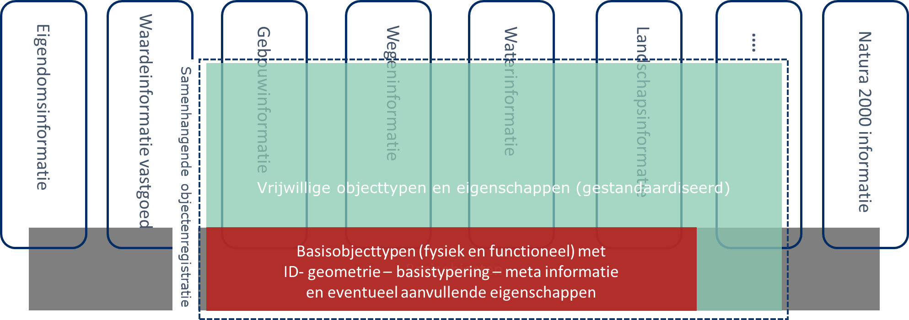

## Uitgangspunten 

In de beleidsvisie (schetsontwerp) zijn een groot aantal uitgangspunten opgenomen voor de verdere uitwerking van een samenhangende objectenregistratie. Alle uitgangspunten uit de beleidsvisie blijven onverminderd van toepassing. Een deel van deze uitgangspunten kan daarbij min of meer direct worden toegepast bij de verdere uitwerking van de inhoud van de samenhangende objectenregistratie. Een ander gedeelte van de uitgangspunten vraagt nog om een iets verdere concretisering. In dit hoofdstuk is een samenhangende beschrijving opgenomen van zowel de direct bruikbare uitgangspunten als de verder geconcretiseerde uitgangspunten. Het is daarbij de bedoeling dat deze verzameling uitgangspunten fungeert als basis voor zowel het verder uitwerken van het conceptueel inhoudelijk denkraam voor de inhoud van de samenhangende objectenregistratie als in de volgende fase voor het kunnen gaan uitwerken van een informatiemodel. De uitgangspunten hebben in principe geen betrekking op andere registraties dan de objectenregistratie. Het gesprek daarover vindt plaats aan andere tafels. Alle uitgangspunten hebben betrekking op de uiteindelijke situatie. Voorafgaand aan de uitgangspunten wordt hierna eerst de scope van de samenhangende objectenregistratie in enkele principes verwoord.

### Scope van de samenhangende objectenregistratie 

**1. 	In de SOR worden uitsluitend objecttypen en eigenschappen van objecttypen opgenomen die van belang zijn voor gebruik in verschillende overheidsdomeinen.**

Met dit uitgangspunt wordt invulling gegeven aan de ook nu al bestaande eisen die worden gesteld aan basisregistraties. De objectenregistratie fungeert daarbij als een onderdeel van het fundament voor een gegevenslandschap waarin aanvullend op dit fundament in sectorale en lokale registraties aanvullende objecttypen en eigenschappen worden geregistreerd. De samenhangende objectenregistratie fungeert daarmee dus als een verbindende schakel tussen de verschillende specifieke eigenschappen die van deze objecttypen zijn geregistreerd in de verschillende sectorale registraties. Daarnaast bevordert de samenhangende objectenregistratie indirect ook de samenhang met in die sectorale registraties opgenomen specifieke objecttypen en eigenschappen daarvan. Deze brugfunctie van de samenhangende objectenregistratie is daarmee essentieel voor het integraal kunnen gebruiken van gegevens.

Dit uitgangspunt betekent praktisch onder meer dat specifieke zoneringen en werkingsgebieden (zoals deze bijvoorbeeld voortvloeien vanuit de Omgevingswet) niet worden opgenomen in de SOR, maar “achterblijven” in sectorale registraties.

**2.	In de SOR worden uitsluitend opgenomen objecttypen die primair bovengronds zijn gelegen en ondergrondse objecttypen die geschikt zijn voor het vervoer van personen als onderdeel van infrastructurele voorzieningen en voor het verbinden van twee bovengrondse waterobjecten.**

De scope van de samenhangende objectenregistratie is in eerste instantie beperkt tot de bovengrond en de ondergrondse delen van objecttypen die ook in het terrein zichtbaar zijn. Daarnaast worden enkele objecttypen uit de BGT die daarin op een ander niveau zijn gepositioneerd ook in de scope van de samenhangende objectenregistratie betrokken. Het gaat daarbij met name om tunneldelen en duikers. Het tweede gedeelte van de formulering richt zich daarop.

Deze afbakening van de scope is een afgeleide van de wens om tot een helder en beheersbaar transitietraject te komen. Het ook opnemen van ondergrondse objecten in de SOR, zoals leidingnetwerken of de verschillende objecttypen die thans worden opgenomen in de Basisregistratie Ondergrond (BRO), zou op dit moment leiden tot een aanzienlijk hogere complexiteit. Dit neemt niet weg dat opname van ondergrondse objecten in de toekomst niet wordt uitgesloten. Het model van de registratie is zodanig opgezet dat op termijn ook ondergrondse objecten in de registratie kunnen worden opgenomen. Deze opname zou in de loop van de tijd ook gefaseerd kunnen plaatsvinden.

**3.	In de SOR worden uitsluitend objecten opgenomen die gelegen zijn op het Europese grondgebied van het Koninkrijk der Nederlanden inclusief de daarbij behorende territoriale wateren.**

Dit uitgangspunt is met name van belang voor het bepalen wat onder grondgebiedsdekkend moet worden verstaan bij de verdere uitwerking van de registratie. Op dit moment wordt daarbij de lijn gevolgd, zoals deze ook wordt gevolgd in het kader van de BAG en de BGT. Deze beperken zich tot het Europese grondgebied van het Koninkrijk der Nederlanden inclusief de daarbij behorende territoriale wateren. Een uitzondering hierop betreft de exclaves van het Koninkrijk België op het Nederlandse grondgebied (Baarle Hertog). Ook objecten in deze exclaves deze worden in de samenhangende objectenregistratie opgenomen.

Een nog nader te onderzoeken vraagpunt is in hoeverre het wenselijk dan wel noodzakelijk is om de territoriale wateren daarbij uit te breiden tot het continentaal plat. Een andere nog nader te onderzoeken vraagpunt is hoe omgegaan moet worden met de het grondgebied van de bijzondere Nederlandse gemeenten (BES-eilanden) en met het grondgebied van de andere Antillen die tot het Koninkrijk der Nederlanden behoren.

**4.	Bestaande objecttypen en de daarbij behorende eigenschappen vanuit de BAG en de BGT, enkele bestaande eigenschappen van objecttypen die raken aan bebouwing vanuit de WOZ en objecttypen en de daarbij behorende eigenschappen vanuit de BRT die (in de toekomst) nodig blijven voor het maken van een vernieuwd BRT kaartproduct, worden (eventueel in andere vorm) overgenomen in de SOR, tenzij er expliciete redenen aanwezig zijn om dat niet te doen.**

De bestaande objecttypen uit de BAG en BGT keren in principe terug in de objectenregistratie, tenzij er voor bepaalde objecttypen expliciet andere keuzen worden gemaakt. Dat laatste lijkt bijvoorbeeld het geval te zijn voor enkele objecttypen in de BGT, die als gevolg van een striktere scheiding tussen fysieke en functionele objecten een ander karakter zullen krijgen dan wel in de huidige vorm zullen verdwijnen. Ten aanzien van de objecttypen uit de BRT zal nog nader bepaald moeten worden welke objecttypen dat betreft. Een aantal van de in de BRT gehanteerde objecttypen komen namelijk in hoge mate overeen met of sluiten in hoge mate aan op objecttypen zoals deze ook  zijn opgenomen in de BAG en de BGT. In de BRT zijn echter ook objecttypen opgenomen die mogelijk een onderdeel zouden moeten gaan uitmaken van de SOR. 

Ook de verschillende aan deze objecttypen verbonden eigenschappen worden in principe opgenomen in de SOR. Dat geldt ook voor een aantal eigenschappen van objecttypen die behoren tot het informatiemodel van de WOZ. Deze eigenschappen kunnen door wijzigingen in het gebouwgedeelte van het informatiemodel van de SOR naar verwachting aan objecttypen in de SOR worden gerelateerd. Voor alle eigenschappen geldt dat hetgeen in de bestaande registraties als eigenschap is opgenomen in de SOR als een objecttype (met een andere benaming) kan worden opgenomen. Dit zal met name het geval zijn bij enkele bestaande typeringen. Eigenschappen worden dan inhoudelijk dus wel overgenomen, maar keren in de SOR terug in een andere vorm (zoals een objecttype) en is dus als zodanig geen eigenschap meer.

### Algemene uitgangspunten samenhangende objectenregistratie

**1. 	In de SOR zijn uitsluitend gestandaardiseerde objecttypen en eigenschappen opgenomen.**

De inhoud van de objectenregistratie is volledig beschreven in de vorm van een standaard. In de registratie komen dus geen objecttypen voor die niet voldoen aan deze standaard. Ook worden in de objectenregistratie uitsluitend gestandaardiseerde eigenschappen van deze objecttypen opgenomen.

Onderdeel van deze standaardisatie is dat van de verschillende objecttypen en eigenschappen ook de beoogde kwaliteit is beschreven. Van de objecttypen is dus opgenomen welke eisen er worden gesteld aan de volledigheid en actualiteit van de in de registratie opgenomen objecten. Van de eigenschappen van de objecttypen is vastgelegd wat de beoogde actualiteit en nauwkeurigheid van de in de registratie opgenomen gegevens is.

**2. 	Definities van zowel objecttypen als eigenschappen van objecttypen zijn scherp afgebakend, niet multi-interpretabel en sluiten waar mogelijk aan op bestaande definities.**

Het is van groot belang dat de basis van een informatiemodel voor een samenhangende objectenregistratie wordt gevormd door een aantal onderling goed afgestemde en heldere definities. In de bestaande basisregistraties is daarvan momenteel niet altijd sprake. Hierdoor wordt de onderlinge koppelbaarheid van gegevens beperkt en laat de uniformiteit van de opgenomen gegevens (door interpretatieverschillen of in de definities opgenomen vrijheidsgraden) nogal eens te wensen over. Bij de verdere uitwerking van de inhoud van een samenhangende objectenregistratie worden bestaande definities daarom zodanig uitgebreid en geharmoniseerd dat: 
- een scherp afgebakende en duidelijke definitie van objecttypen ontstaat;
- definities elkaar semantisch niet overlappen;
- er niet langer gebruik wordt gemaakt van verzamelclassificaties;
- een optimale aansluiting op overkoepelende modellen en sectorale modellen wordt gerealiseerd, zoals NEN 3610 (Basismodel Geo-informatie) en NEN 2660 (Ordeningsregels voor gegevens in de bouw - Termen, definities en algemene regels)

**3. Objecttypen en eigenschappen van objecttypen moeten in de SOR worden opgenomen als deze in het kader van de SOR als wettelijk verplicht zijn aangemerkt en mogen in de registratie worden opgenomen als deze als vrijwillig zijn aangemerkt in het kader van de SOR.**

De grondgedachte van de samenhangende objectenregistratie is dat deze bestaat uit:

- verplichte en gestandaardiseerde objecttypen en eigenschappen (het formele basisregistratie gedeelte)
- vrijwillige maar wel gestandaardiseerde objecttypen en eigenschappen

Hierbij is het belangrijk dat opname van vrijwillige objecten en gegevens door een bronhouder ook betekent dat deze gegevens blijvend worden bijgehouden. Voor alle opgenomen objecten en gegevens (zowel in het verplichte als het vrijwillige gedeelte) gelden dus blijvend de bijhoudingsregels die behoren bij het betreffende objecttype en eigenschappen. Bij de verdere uitwerking van de organisatie van de samenhangende objectenregistratie zullen afspraken moeten worden gemaakt over de omgang met in de registratie opgenomen objecten en gegevens die blijvend niet aan de bijhoudingsregels voldoen.

Voor het basisregistratie gedeelte gelden de 12 eisen die aan basisregistraties worden gesteld (https://www.digitaleoverheid.nl/overzicht-van-alle-onderwerpen/gegevens/naar-een-gegevenslandschap/themas/twaalf-eisen-stelsel-van-basisregistraties/) en waarvan voor de verdere uitwerking van de inhoud van de samenhangende objectenregistratie met name de eisen 6 (er is duidelijkheid over inhoud en bereik van de registratie) en 11 (de positie van de basisregistratie binnen het stelsel van basisregistraties is duidelijk en de relaties met de basisregistraties zijn beschreven) van belang zijn.

Het onderscheid tussen het verplichte gedeelte en het vrijwillige gedeelte kan (zoals ook opgenomen in de beleidsvisie) als volgt worden gevisualiseerd:

Dit betekent dus dat gebruikers van het verplichte gedeelte van de samenhangende objectenregistratie zekerheid hebben over de volledigheid van de daarin opgenomen objecten en gegevens. Omdat bronhouders de keuze hebben om objecten of gegevens al dan niet op te nemen in het vrijwillige gedeelte van de objectenregistratie, hebben gebruikers van de samenhangende objectenregistratie die zekerheid niet bij de vrijwillig op te nemen objecten en gegevens. In de communicatie rondom de informatieproducten van de samenhangende objectenregistratie zal dit principe en de mate waarin verschillende bronhouders al dan geen gebruik maken van het vrijwillige gedeelte duidelijk gecommuniceerd moeten worden.

**4. 	Objecttypen en eigenschappen van objecttypen worden zodanig in de SOR opgenomen dat uitbreiding en inkrimping van het aantal objecttypen en eigenschappen en het aanpassen van de kwalificatie van objecttypen en eigenschappen als verplicht of vrijwillig binnen het informatiemodel eenvoudig mogelijk is.**

Het moet mogelijk zijn om de inhoud van de samenhangende objectenregistratie relatief eenvoudig aan te kunnen passen. Dit begint met een informatiemodel dat dergelijke aanpassingen kan faciliteren. Dat betekent dat bijvoorbeeld het onderscheid tussen verplichte en vrijwillige objecten in de registratie niet diepgaand in het uitgewerkte informatiemodel moet worden verankerd. Of aanpassing ook daadwerkelijk zal plaatsvinden is uiteraard afhankelijk van de afspraken die er worden gemaakt over de wijze waarop besluitvorming over wijzigingen plaatsvindt en hoe er wordt omgegaan met de gevolgen daarvan voor bronhouders en gebruikers. Bij het doorvoeren van dit soort wijzigingen moeten er altijd heldere transitieafspraken worden gemaakt.

### Scope

*Beschrijf hier de scope van het rapport, wat wordt wel en niet uitgewerkt en waarom, enz ...* 

Lorem ipsum dolor sit amet, consectetuer adipiscing elit. Aenean commodo ligula eget dolor. 
Aenean massa. Cum sociis natoque penatibus et magnis dis parturient montes, nascetur ridiculus mus. Donec quam felis, 
ultricies nec, pellentesque eu, pretium quis, sem. Nulla consequat massa quis enim. Donec pede justo, fringilla vel, 
aliquet nec, vulputate eget, arcu. In enim justo, rhoncus ut, imperdiet a, venenatis vitae, justo.
Nullam dictum felis eu pede mollis pretium. Integer tincidunt. Cras dapibus. Vivamus elementum semper nisi. 
Aenean vulputate eleifend tellus. Aenean leo ligula, porttitor eu, consequat vitae, eleifend ac, enim. 
Aliquam lorem ante, dapibus in, viverra quis, feugiat a, tellus. Phasellus viverra nulla ut metus varius laoreet. 
Quisque rutrum. Aenean imperdiet. Etiam ultricies nisi vel augue. 
Curabitur ullamcorper ultricies nisi. Nam eget dui.

###	Werkproces

*Beschrijf hier wat het gevolgde proces is om te komen tot het rapport, denk aan desktop research, expertsessies, consultatierondes, enz ...*

Lorem ipsum dolor sit amet, consectetuer adipiscing elit. Aenean commodo ligula eget dolor. 
Aenean massa. Cum sociis natoque penatibus et magnis dis parturient montes, nascetur ridiculus mus. Donec quam felis, 
ultricies nec, pellentesque eu, pretium quis, sem. Nulla consequat massa quis enim. Donec pede justo, fringilla vel, 
aliquet nec, vulputate eget, arcu. In enim justo, rhoncus ut, imperdiet a, venenatis vitae, justo.
Nullam dictum felis eu pede mollis pretium. Integer tincidunt. Cras dapibus. Vivamus elementum semper nisi. 
Aenean vulputate eleifend tellus. Aenean leo ligula, porttitor eu, consequat vitae, eleifend ac, enim. 
Aliquam lorem ante, dapibus in, viverra quis, feugiat a, tellus. Phasellus viverra nulla ut metus varius laoreet. 
Quisque rutrum. Aenean imperdiet. Etiam ultricies nisi vel augue. 
Curabitur ullamcorper ultricies nisi. Nam eget dui.

###	Stakeholders

*Geef een overzicht van de Stakeholders, hun rollen, hun belangen enz ...*
Lorem ipsum dolor sit amet, consectetuer adipiscing elit. Aenean commodo ligula eget dolor. 
Aenean massa. Cum sociis natoque penatibus et magnis dis parturient montes, nascetur ridiculus mus. Donec quam felis, 
ultricies nec, pellentesque eu, pretium quis, sem. Nulla consequat massa quis enim. Donec pede justo, fringilla vel, 
aliquet nec, vulputate eget, arcu. In enim justo, rhoncus ut, imperdiet a, venenatis vitae, justo.
Nullam dictum felis eu pede mollis pretium. Integer tincidunt. Cras dapibus. Vivamus elementum semper nisi. 
Aenean vulputate eleifend tellus. Aenean leo ligula, porttitor eu, consequat vitae, eleifend ac, enim. 
Aliquam lorem ante, dapibus in, viverra quis, feugiat a, tellus. Phasellus viverra nulla ut metus varius laoreet. 
Quisque rutrum. Aenean imperdiet. Etiam ultricies nisi vel augue. 
Curabitur ullamcorper ultricies nisi. Nam eget dui.

###	Bestaande registraties

*Indien van toepassing: Welke bestaande registraties worden geraakt in het rapport, en hoe ...*

Lorem ipsum dolor sit amet, consectetuer adipiscing elit. Aenean commodo ligula eget dolor. 
Aenean massa. Cum sociis natoque penatibus et magnis dis parturient montes, nascetur ridiculus mus. Donec quam felis, 
ultricies nec, pellentesque eu, pretium quis, sem. Nulla consequat massa quis enim. Donec pede justo, fringilla vel, 
aliquet nec, vulputate eget, arcu. In enim justo, rhoncus ut, imperdiet a, venenatis vitae, justo.
Nullam dictum felis eu pede mollis pretium. Integer tincidunt. Cras dapibus. Vivamus elementum semper nisi. 
Aenean vulputate eleifend tellus. Aenean leo ligula, porttitor eu, consequat vitae, eleifend ac, enim. 
Aliquam lorem ante, dapibus in, viverra quis, feugiat a, tellus. Phasellus viverra nulla ut metus varius laoreet. 
Quisque rutrum. Aenean imperdiet. Etiam ultricies nisi vel augue. 
Curabitur ullamcorper ultricies nisi. Nam eget dui.

###	Wettelijk kader  

*Indien van toepassing: Welke wettelijk geldt voor het rapport?*

Lorem ipsum dolor sit amet, consectetuer adipiscing elit. Aenean commodo ligula eget dolor. 
Aenean massa. Cum sociis natoque penatibus et magnis dis parturient montes, nascetur ridiculus mus. Donec quam felis, 
ultricies nec, pellentesque eu, pretium quis, sem. Nulla consequat massa quis enim. Donec pede justo, fringilla vel, 
aliquet nec, vulputate eget, arcu. In enim justo, rhoncus ut, imperdiet a, venenatis vitae, justo.
Nullam dictum felis eu pede mollis pretium. Integer tincidunt. Cras dapibus. Vivamus elementum semper nisi. 
Aenean vulputate eleifend tellus. Aenean leo ligula, porttitor eu, consequat vitae, eleifend ac, enim. 
Aliquam lorem ante, dapibus in, viverra quis, feugiat a, tellus. Phasellus viverra nulla ut metus varius laoreet. 
Quisque rutrum. Aenean imperdiet. Etiam ultricies nisi vel augue. 
Curabitur ullamcorper ultricies nisi. Nam eget dui.

###	Relevante standaarden en modellen

*Indien van toepassing: Beschrijf de voor het rapport relevante standaarden en eventuele (reken)modellen*

Lorem ipsum dolor sit amet, consectetuer adipiscing elit. Aenean commodo ligula eget dolor. 
Aenean massa. Cum sociis natoque penatibus et magnis dis parturient montes, nascetur ridiculus mus. Donec quam felis, 
ultricies nec, pellentesque eu, pretium quis, sem. Nulla consequat massa quis enim. Donec pede justo, fringilla vel, 
aliquet nec, vulputate eget, arcu. In enim justo, rhoncus ut, imperdiet a, venenatis vitae, justo.
Nullam dictum felis eu pede mollis pretium. Integer tincidunt. Cras dapibus. Vivamus elementum semper nisi. 
Aenean vulputate eleifend tellus. Aenean leo ligula, porttitor eu, consequat vitae, eleifend ac, enim. 
Aliquam lorem ante, dapibus in, viverra quis, feugiat a, tellus. Phasellus viverra nulla ut metus varius laoreet. 
Quisque rutrum. Aenean imperdiet. Etiam ultricies nisi vel augue. 
Curabitur ullamcorper ultricies nisi. Nam eget dui.

###	Relevante documentatie 

*Geef een overzicht van de relvante bestaande docuementatie en hoe die wordt gebruikt in het rapport*

Lorem ipsum dolor sit amet, consectetuer adipiscing elit. Aenean commodo ligula eget dolor. 
Aenean massa. Cum sociis natoque penatibus et magnis dis parturient montes, nascetur ridiculus mus. Donec quam felis, 
ultricies nec, pellentesque eu, pretium quis, sem. Nulla consequat massa quis enim. Donec pede justo, fringilla vel, 
aliquet nec, vulputate eget, arcu. In enim justo, rhoncus ut, imperdiet a, venenatis vitae, justo.
Nullam dictum felis eu pede mollis pretium. Integer tincidunt. Cras dapibus. Vivamus elementum semper nisi. 
Aenean vulputate eleifend tellus. Aenean leo ligula, porttitor eu, consequat vitae, eleifend ac, enim. 
Aliquam lorem ante, dapibus in, viverra quis, feugiat a, tellus. Phasellus viverra nulla ut metus varius laoreet. 
Quisque rutrum. Aenean imperdiet. Etiam ultricies nisi vel augue. 
Curabitur ullamcorper ultricies nisi. Nam eget dui.

<aside class='note'>
    NB: gebruik de in config.js gedefinieerde localBiblio!
</aside> 

| Verwijzing | Kolom-2 | Kolom-3 | Kolom 4 | Kolom-n | 
|------------|---------|---------|---------|---------| 
| [[PUB-1]]  |         |         |         |         |
| [[PUB-2]]  |         |         |         |         |
| [[PUB-3]]  |         |         |         |         |
| [[PUB-4]]  |         |         |         |         |
